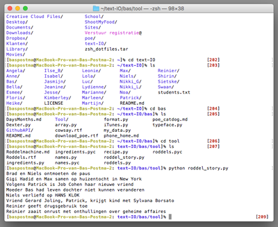
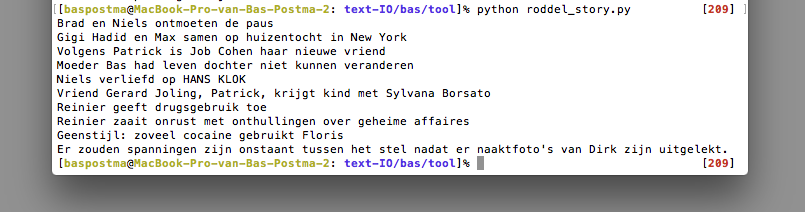

# Bas's work for Text IO 

## Homework 

###Array
[Array](array.py)

###Dictionary
[Format](format.py)

[Dictionary Room](my_data.py)

###Data structure I
[Data structure Dexter](Dexter.py)

[Data structure ITunes](Itunes.py)

## Excercises for working with the shell

### Months and Days
[Months and days](DaysMonths.md)

### Cowsay
[Cowsay](cowsay.txt)

### Research Edgar Allan Poe
[Pou](pou_catdog.md)

### Phone Home
[Phone Home](phonehome.md)

## Group Type
[Typeface](typeface.md)

## Concept

Roddelmachine - InOut Type. 

Aan de In kant zijn 2 lijsten aangemaakt worden. 1 lijst zullen namen zijn van mede studeren en evenueel leraren. Aan de andere kant zullen 'roddel' zinnen wor
den gemaakt. 

Example: "Vorige week hebben %s en %s in de zeefdrukwerkplaats zitten %s.Toen %s binnenkwam, duwde %s, %s van zich af. 

Voorbeeld namen: 
					'naam1': "Max",
					'naam2': "Floris", 
					'naam3': "Leonie", 
					'naam4': "Marianne", 
					'naam5': "Niels", 
					'naam6': "Noa", 
					'naam7': "Lola", 
					'naam8': "Reinier", 
					'naam9': "Jeanine", 
					'naam10': "Bas", 
					'naam11': "Martijn",

Voorbeeld activiteiten: 

					'taak1': "zoenen",
					'taak2': "discusseren over het leven", 
					'taak3': "insmeren met zeefdruk verf", 
					'taak4': "vechten", 
					'taak5': "elkaar uitschelden voor lelijke fonts", 
					'taak6': "laten huilen", 
					'taak7': "door de drukpers halen", 
					'taak8': "print naaktfoto's", 
					'taak9': "wil zijn code niet delen", 
					'taak10': "doodgooien met pindakaas", 
					'taak11': "delete zijn bestanden", 

## Prototype: working demo

## Design the flow of the program

## How to use the script
Om de code te gebruiken moet je als eerst 2 bestanden installeren. 
Het eerste bestand is er een die bestaat uit verhalen. 
Het tweede bestand is er een die bestaat uit namen.

Aan de In kant zijn 2 lijsten aangemaakt worden. 1 lijst zullen namen zijn van mede studeren en evenueel leraren. Aan de andere kant zullen 'roddel' zinnen wor den gemaakt.

Download map: ‘concept_roddel’ (sla hem ergens op waar je hem kan terugvinden)
	Map bestaat uit: - README.md
				 - format.py
				 - my_data.py 
				 - roddelmachine.md
				 - roddels.txt

	◆	format.py Is het bestand waarin de verhalen staan zonder namen. 
	◆	my_data.py is het bestand waarin de namen staan
	
	Download de bestanden format.py en my_data.py
	

Open vervolgens de terminal en ga opzoek naar waar je format.py en my_data.py hebt opgeslagen. 
Run vervolgens my format: python format.py
