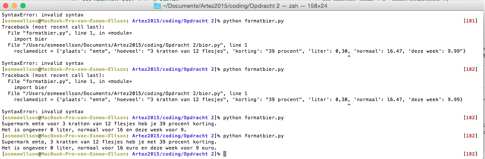

# Esmee's work for Text IO 

## Homework


```
>>> couses = ['Photography', 'Design Philosophy', 'Media Theory', 'Design Research', 'Digital Media', 'Computer Skills', 'Graphic Design', 'Typography']
>>> print len(couses)
8
>>> couses.append(Media Theory lecture series)
  File "<stdin>", line 1
    couses.append(Media Theory lecture series)
                             ^
SyntaxError: invalid syntax
>>> couses.append(9)
>>> 9=[Media Theory lecture series]
  File "<stdin>", line 1
    9=[Media Theory lecture series]
                  ^
SyntaxError: invalid syntax
>>> couses.append(Media Theory lecture series)
  File "<stdin>", line 1
    couses.append(Media Theory lecture series)
                             ^
SyntaxError: invalid syntax
>>> print len(couses)
9
>>> couses.pop(9)
Traceback (most recent call last):
  File "<stdin>", line 1, in <module>
IndexError: pop index out of range
>>> couses.pop()9
  File "<stdin>", line 1
    couses.pop()9
                ^
SyntaxError: invalid syntax
>>> couses.pop(9)
Traceback (most recent call last):
  File "<stdin>", line 1, in <module>
IndexError: pop index out of range
>>> len(couses)
9

```


```
>>> [0,1,2,3]
[0, 1, 2, 3]
>>> reeks = [0,1,2,3]
>>> reeks
[0, 1, 2, 3]
>>> naam= "Esmee"
>>> vakken= ["Photography", "Design Philosophy", "Media Theory", "Design Research", "Digital Media", "Computer Skills", "Graphic Design", "Typograhy"]
>>> vakken
['Photography', 'Design Philosophy', 'Media Theory', 'Design Research', 'Digital Media', 'Computer Skills', 'Graphic Design', 'Typograhy']
>>> len(vakken)
8
>>> vakken.pop()
'Typograhy'
>>> len (vakken)
7
>>> vakken.append("Typography")
>>> len(vakken)
8
>>> vakken.append("Media Theory Lectures")
>>> len(vakken)
9
>>> vakken.pop()
'Media Theory Lectures'
>>> len(vakken)
8
```


```
>>> heading ={}
>>> heading["adres"] = "Janthijssenstraat 13"
>>> heading["hoogte"] = "2.85m"
>>> heading["omtrek"] = "3.50m 2.80m"
>>> heading["deur"] = "1 deur"
>>> heading["raam"] = "1 raam"
>>> heading["kast"] = "4 kasten"
>>> print heading
{'omtrek': '3.50m 2.80m', 'raam': '1 raam', 'adres': 'Janthijssenstraat 13', 'kast': '4 kasten', 'deur': '1 deur', 'hoogte': '2.85m'}
```


```
>>> huis={'adres': "Janthijssenstraat 13", 'huisdier': 0, 'ramen': 21, 'deuren':8, 'kleuren': "blauw, grijs, zilver, wit, aqua, antraciet, paars, zwart"}
>>> huis
{'huisdier': 0, 'ramen': 21, 'kleuren': 'blauw, grijs, zilver, wit, aqua, antraciet, paars, zwart', 'adres': 'Janthijssenstraat 13', 'deuren': 8}
>>> print d['adres']
>>> d['deuren'] = "Ik woon in een huis met 8 deuren"
print d[\deuren']

sentence = "Ik woon bij mijn moeder en we hebben geen %s huisdieren. We hebben %d deuren en %d ramen. We hebben veel kleuren in huis zoals %d." % ['adres']
print sentence

```

 

## Concept
You type one product word and you see the commercial discounts for that product.

## Prototype: working demo


[drawning 1](conceptmap/bier.pv)


[drawning 1](conceptmap/formatbier.py)

## Design the flow of the program

## How to use the script

## PDF format 
			
