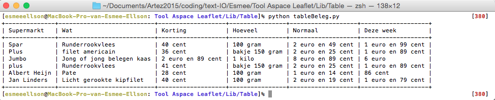
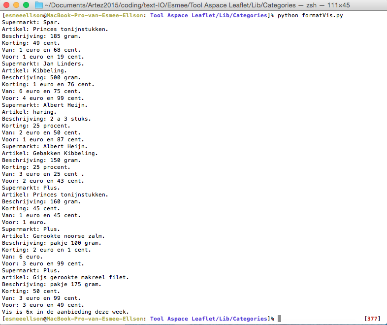
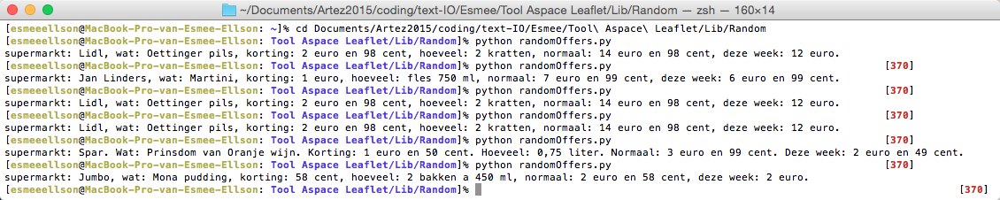

#Apace leaflet
##Desc

Ever need a quick list from offers from the supermarket? Normal you look at offers from the supermarket in the store/app/leaflet/website.  Maybe you don't need to look at all the leaflets. Apeace Leaflet is a collection of offers that you can those by categoies and saves you a lot of old paper.


##Table of Contents
Install</br>
Setup</br>
Usage</br>
License</br>

##Install
terminaltables

##Setup

To get started you will need terminaltables to manage such as python tables. To install please run the following command:

```
pip install terminaltables
```
You can make also a leaflet by yourself.

```
from terminaltables import AsciiTable
table_data = [
    ['Heading1', 'Heading2'],
    ['row1 column1', 'row1 column2'],
    ['row2 column1', 'row2 column2']
]
table = AsciiTable(table_data)
print table.table

+--------------+--------------+
| Supermarktet | Beleg			|
+--------------+--------------+
| Jumbo		   | Salami 		|
| Coop		   | Worst			|

```

There is really only three modes right now for it.

####To get just a plain table you can choise one of the categories:</br>

Alcohol</br>
Beleg</br>
Brood</br>
Chips</br>
Chocolade</br>
Dessert</br>
Frisdrank</br>
Fruit</br>
Groente</br>
Koeken </br>
Koffie</br>
Nootjes</br>
Pizza </br>
Schoonmaakmiddelen</br>
Soep</br>
Tandpasta</br>
Toiletpapier</br>
Vis</br>
Vlees</br>

You choise Soep then can you command:

```
$ python tableBeleg.py
```

####To get the offers without the table you choice one category:

```
$ python formatVis.py
```

####To get a random offer you can use:

```
$ python randomOffers.py
```

That's all there is, very simple.


##Usage

Table



List



Random



##License (MIT License)

Apeace Leaflet is released under the MIT license.

Copyright © 2016 Esmee Ellson 

Permission is hereby granted, free of charge, to any person obtaining a copy of this software and associated documentation files (the “Software”), to deal in the Software without restriction, including without limitation the rights to use, copy, modify, merge, publish, distribute, sublicense, and/or sell copies of the Software, and to permit persons to whom the Software is furnished to do so, subject to the following conditions:

The above copyright notice and this permission notice shall be included in all copies or substantial portions of the Software.

THE SOFTWARE IS PROVIDED “AS IS”, WITHOUT WARRANTY OF ANY KIND, EXPRESS OR IMPLIED, INCLUDING BUT NOT LIMITED TO THE WARRANTIES OF MERCHANTABILITY, FITNESS FOR A PARTICULAR PURPOSE AND NONINFRINGEMENT. IN NO EVENT SHALL THE AUTHORS OR COPYRIGHT HOLDERS BE LIABLE FOR ANY CLAIM, DAMAGES OR OTHER LIABILITY, WHETHER IN AN ACTION OF CONTRACT, TORT OR OTHERWISE, ARISING FROM, OUT OF OR IN CONNECTION WITH THE SOFTWARE OR THE USE OR OTHER DEALINGS IN THE SOFTWARE.
