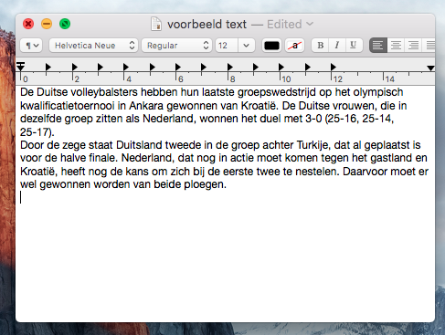
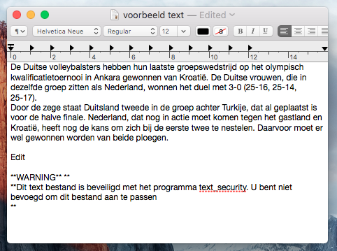
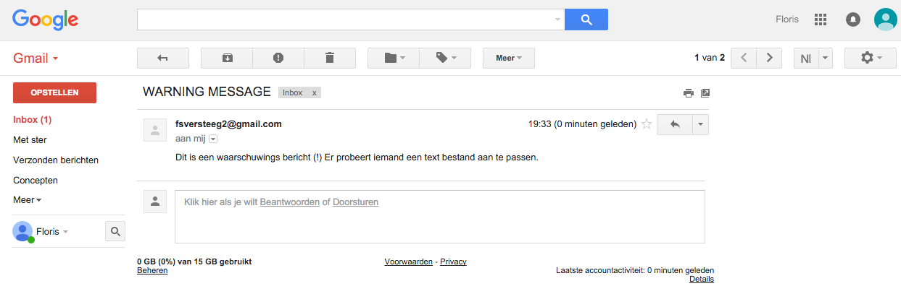
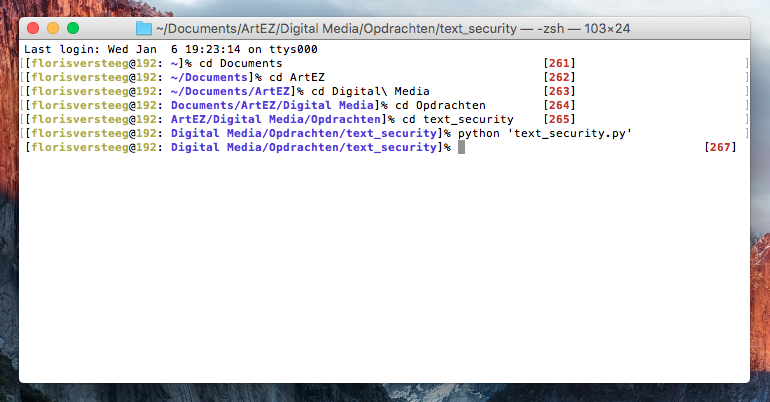

# Floris's work for Text IO 

naam programma: text_security.
OS in gebruik: OS X El Capitan 10.11.1

## logo

## Concept
Text_security is een programma dat text bestanden beveiligd. Bij het openen en lezen van een text file is er niks aan de hand.(zie screenshot fase1) Echter bij het bewerken van deze beveiligde bestanden krijgt men een waarschuwings bericht. (zie screenshot fase1&2) 

Achter de schermen stuurt text_security een waarschuwingsmail dat er een text file bewerkt wordt. (zie screenshot fase 3 en 4) 

De uitvoering van dit proces is fictief.
Om het programma actief te maken is het nodig het python bestand text_security.py te openen in de terminal. 

Copyright 2016:
ArtEZ Graphic Design (GDA)
Floris Versteeg 2A

## How to use the script
open in de terminal de python file text_security.py
terminal command: "python 'text_security.py'"

Last login: Wed Jan  6 19:23:14 on ttys000
[florisversteeg@192: ~]% cd Documents                                     [261]
[florisversteeg@192: ~/Documents]% cd ArtEZ                               [262]
[florisversteeg@192: ~/Documents/ArtEZ]% cd Digital\ Media                [263]
[florisversteeg@192: Documents/ArtEZ/Digital Media]% cd Opdrachten        [264]
[florisversteeg@192: ArtEZ/Digital Media/Opdrachten]% cd text_security    [265]
[florisversteeg@192: Digital Media/Opdrachten/text_security]% python 'text_security.py'
[florisversteeg@192: Digital Media/Opdrachten/text_security]%                                    [267]

