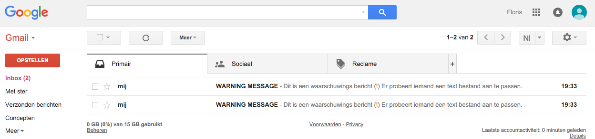

# Floris's work for Text IO 


naam programma: text_security.
OS in gebruik: OS X El Capitan 10.11.1

## logo


## Concept
Text_security is een programma dat text bestanden beveiligd. Bij het openen en lezen van een text file is er niks aan de hand.(zie screenshot fase1) Echter bij het bewerken van deze beveiligde bestanden krijgt men een waarschuwings bericht. (zie screenshot fase1&2) 


Achter de schermen stuurt text_security een waarschuwingsmail dat er een text file bewerkt wordt. (zie screenshot fase 3 en 4)<br>



De uitvoering van dit proces is fictief.
Om het programma actief te maken is het nodig het python bestand text_security.py te openen in de terminal. 


## How to use the script
open in de terminal de python file text_security.py
terminal command: "python 'text_security.py'"

Last login: Wed Jan  6 19:23:14 on ttys000
[florisversteeg@192: ~]% cd Documents                                     [261]
[florisversteeg@192: ~/Documents]% cd ArtEZ                               [262]
[florisversteeg@192: ~/Documents/ArtEZ]% cd Digital\ Media                [263]
[florisversteeg@192: Documents/ArtEZ/Digital Media]% cd Opdrachten        [264]
[florisversteeg@192: ArtEZ/Digital Media/Opdrachten]% cd text_security    [265]
[florisversteeg@192: Digital Media/Opdrachten/text_security]% python 'text_security.py'
[florisversteeg@192: Digital Media/Opdrachten/text_security]%                                    [267]


[text_security.pv](text_security/text_security.pv) <br>

```
import smtplib
from email.MIMEMultipart import MIMEMultipart
from email.MIMEText import MIMEText

fromaddr = "fsversteeg2@gmail.com"
toaddr = "fsversteeg2@gmail.com"

msg = MIMEMultipart()
msg['From'] = fromaddr
msg['To'] = toaddr
msg['Subject'] = "WARNING MESSAGE"
body = "Dit is een waarschuwings bericht (!) Er probeert iemand een text bestand aan te passen."
msg.attach(MIMEText(body, 'plain'))

server = smtplib.SMTP('smtp.gmail.com', 587)
server.starttls()
server.login(fromaddr, "Wdrrhb22/")
text = msg.as_string()
server.sendmail(fromaddr, toaddr, text)
server.quit()
```

MusicPlayer is released under the MIT license.

Copyright © 2016 Floris Versteeg
ArtEZ Graphic Design (GDA)


Permission is hereby granted, free of charge, to any person obtaining a copy of this software and associated documentation files (the “Software”), to deal in the Software without restriction, including without limitation the rights to use, copy, modify, merge, publish, distribute, sublicense, and/or sell copies of the Software, and to permit persons to whom the Software is furnished to do so, subject to the following conditions:

The above copyright notice and this permission notice shall be included in all copies or substantial portions of the Software.

THE SOFTWARE IS PROVIDED “AS IS”, WITHOUT WARRANTY OF ANY KIND, EXPRESS OR IMPLIED, INCLUDING BUT NOT LIMITED TO THE WARRANTIES OF MERCHANTABILITY, FITNESS FOR A PARTICULAR PURPOSE AND NONINFRINGEMENT. IN NO EVENT SHALL THE AUTHORS OR COPYRIGHT HOLDERS BE LIABLE FOR ANY CLAIM, DAMAGES OR OTHER LIABILITY, WHETHER IN AN ACTION OF CONTRACT, TORT OR OTHERWISE, ARISING FROM, OUT OF OR IN CONNECTION WITH THE SOFTWARE OR THE USE OR OTHER DEALINGS IN THE SOFTWARE.


