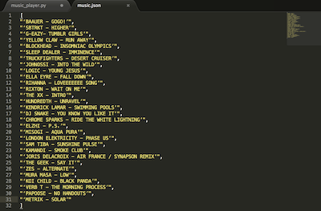

# MusicPlayer

## Omschrijving

De MusicPlayer zal u alle 3 minuten nieuwe muziek laten zien. Dit doet hij doormiddel van een notificatie die boven links in het scherm verschijnt.
U schrijft een lijst met songs en interprets of kunt een lijst laten schrijven.
De lijst met songs en interprets kan continu bijgewerkt worden in de .jsonfile.

## Installeer

Installeer de twee files music.json en music_player.py op uw desktop, daarna dient u de files via de terminal doormiddel het typen van "cd desktop, daarna python music_player.py".
Nu zal de musicplayer alle 3 minuten een random song met interpret laten zien.

## Screenshots

###License (MIT License) 

MusicPlayer is released under the MIT license.

Copyright © 2015 Lydienne Albertoe albertoe@live.nl

Permission is hereby granted, free of charge, to any person obtaining a copy of this software and associated documentation files (the “Software”), to deal in the Software without restriction, including without limitation the rights to use, copy, modify, merge, publish, distribute, sublicense, and/or sell copies of the Software, and to permit persons to whom the Software is furnished to do so, subject to the following conditions:

The above copyright notice and this permission notice shall be included in all copies or substantial portions of the Software.

THE SOFTWARE IS PROVIDED “AS IS”, WITHOUT WARRANTY OF ANY KIND, EXPRESS OR IMPLIED, INCLUDING BUT NOT LIMITED TO THE WARRANTIES OF MERCHANTABILITY, FITNESS FOR A PARTICULAR PURPOSE AND NONINFRINGEMENT. IN NO EVENT SHALL THE AUTHORS OR COPYRIGHT HOLDERS BE LIABLE FOR ANY CLAIM, DAMAGES OR OTHER LIABILITY, WHETHER IN AN ACTION OF CONTRACT, TORT OR OTHERWISE, ARISING FROM, OUT OF OR IN CONNECTION WITH THE SOFTWARE OR THE USE OR OTHER DEALINGS IN THE SOFTWARE.

