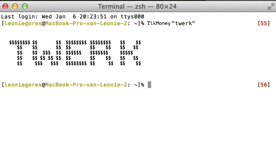

# Leonie's work for Text IO 

## Homework
[Courses](array.pv)  
[Dictionary Leonie](format.py)  
[Data Leonie](my_data_file.py)  
[Spotify](spotify.pv)  
[font_database](font.pv)  
[Cowsay](Cowsay.md)
[Poe](Poe1.md)
[phonehome](phonehome.md)

##concept
	$$$$$$$$$$$$$$$$$$$$$$$$$$$$$$$$$

A tool to give some extra blinggangstaflavour to your story. A typetool that transform normal words to a dollar word. *catchinggg* 

	$$$$$$$$$$$$$$$$$$$$$$$$$$$$$$$$$
## Prototype: working demo

## Design the flow of the program

## How to use the script

## PDF format 
			
