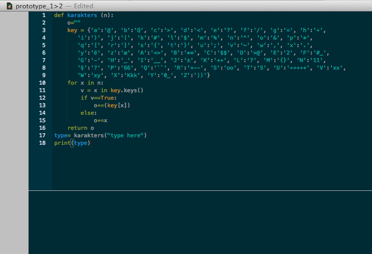
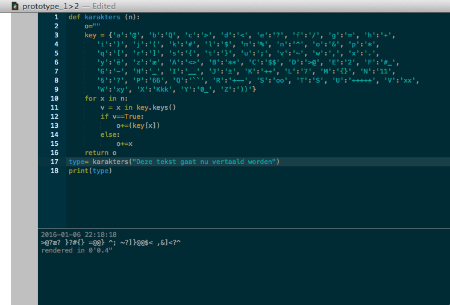
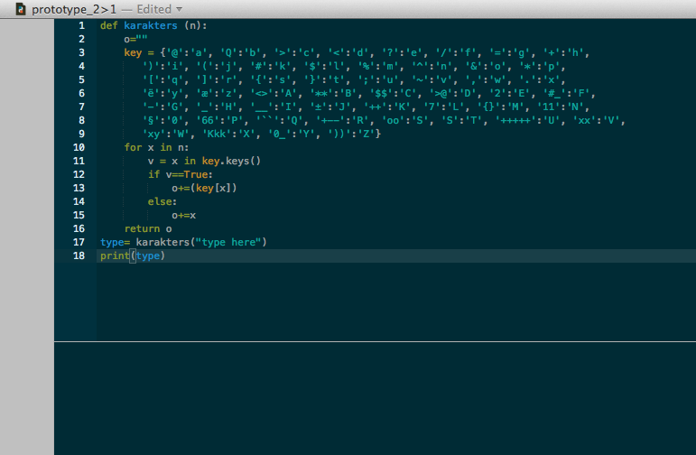
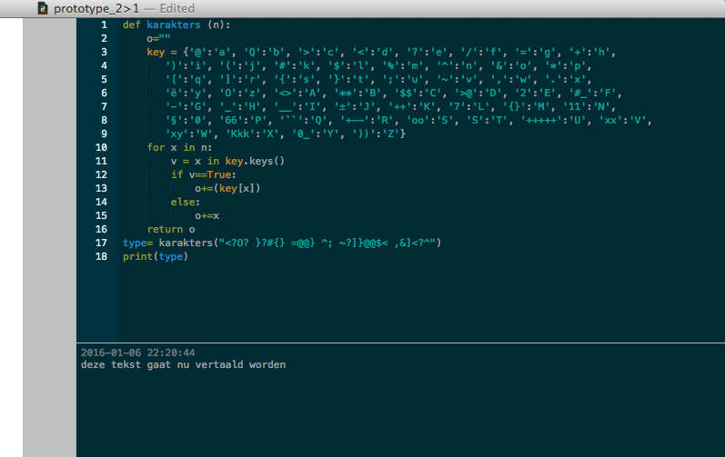
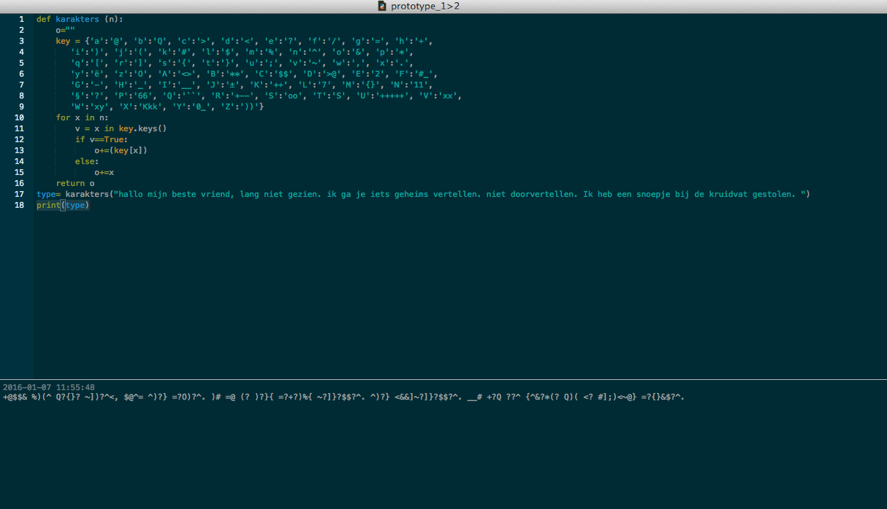
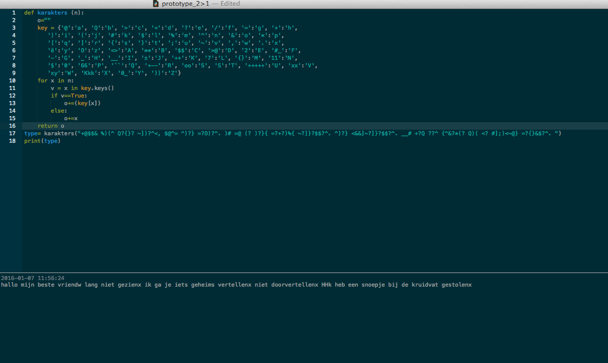

# Lola's work for Text IO 

## Homework

[1. List](list_courses.pv) 

[2 format Dictonairy](format_room.py) 

[2 data Dictonairy](my_data_room.py) 

[3. Spotify](itunes.pv) 

[4. Folders](search_files.md) 

[5. Search Files](search_files.md) 

[6. Cowsay](cowsay.md) 

[7. Poe](poe.md) 

[8. Adobe](phone_behavior.md)

## Concept

Het concept van mijn script is dat als je een letter invoert er een andere letter of symbool uitkomt. Zo kan je een tekst in code taal schrijven. Het idee is een beetje zoals rot 13. 

Ook wil ik dat de code om te draaien is zodat je samen met een vriend of vriendin het bestand kan delen en zo code taal naar elkaar kan uitwisselen en het ook weer kan terug decoderen. 

Dit is een voorbeeld van rot13:

Origineel:  	a	b	c	d	e	f	g	h	i	j	k	l	m	n	o	p	q	r	s	t	u	v	w	x	y	z

Vervanging:  	n	o	p	q	r	s	t	u	v	w	x	y	z	a	b	c	d	e	f	g	h	i	j	k	l	m

## Prototype: working demo

Met deze twee voorbeelden zou je dan samen in code taal kunnen typen:

[prototype code 1](prototype1.png)

[prototype code 2](prototype2.png)

## Design the flow of the program

python:

[Script 1](secretcode1.py)

[Script 2](secretcode2.py)

Dit zijn mijn 2 scriptjes op python, Als ik ze in de terminal open werken ze niet. Maar op plotdive wel.

plotdivice:

[Script 1](prototype_1>2.pv)

[Script 2](prototype_2>1.pv)

## How to use the script

in het mapje "tool" staan de volgende bestanden,

[readme](README_tool.md) 

hij linkt de read me file niet?!
dit staat erin:

## what is the tool?

Thit tool provides you and your friend a way to send secret messeges to eachother. It is a code that that translates your normal messegas into a secret message that only you and your friend can read. In the input you can add upper and lower case, and the output will be a mix of numbers symbols and different letter combinations. The result will be a text only readeble for you and your friend. The tool exist of 2 scipts, one that makes the secret message and one that decodes it. 

 
## how to install?

step 1: Install plotdivice > http://plotdevice.io/

step 2: Open the zip file with the 2 plotdivice codes. 

step 3: Code "Prototype1>2.pv" is the code which you creat the secret langues, on the line where stand "type here" you type the text you want to translate into a secret langues. 

step 4: With the code "Prototype2>1.pv" you do the opposite, on the line where stand "type here" you type the text you want to translate into a secret langues.
stap 5: Als je de tekst hebt ingevoert bij "type here" moet je nog op "command r" drukken. Nu werkt het script.

step 5: Press "command r" and it will run. Now your message will be translated. 

[tool](secretcode.zip) 

sreenshot 

sreenshot 

sreenshot 

sreenshot 

exampel 

exampel 

## PDF format 
			
