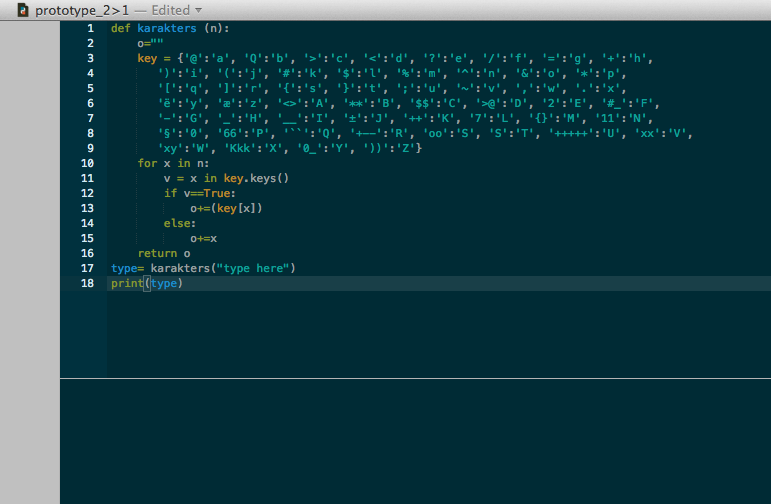

## what is the tool?

Thit tool provides you and your friend a way to send secret messeges to eachother. It is a code that that translates your normal messegas into a secret message that only you and your friend can read. In the input you can add upper and lower case, and the output will be a mix of numbers symbols and different letter combinations. The result will be a text only readeble for you and your friend. The tool exist of 2 scipts, one that makes the secret message and one that decodes it. 

 
## how to install?

step 1: Install plotdivice > http://plotdevice.io/

step 2: Open the zip file with the 2 plotdivice codes. 

step 3: Code "Prototype1>2.pv" is the code which you creat the secret langues, on the line where stand "type here" you type the text you want to translate into a secret langues. 

step 4: With the code "Prototype2>1.pv" you do the opposite, on the line where stand "type here" you type the text you want to translate into a secret langues.
stap 5: Als je de tekst hebt ingevoert bij "type here" moet je nog op "command r" drukken. Nu werkt het script.

step 5: Press "command r" and it will run. Now your message will be translated. 

## screenshots

## exampels of your tool

## license

