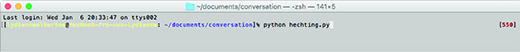
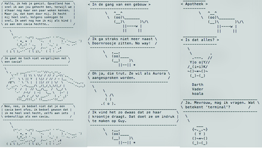

##Cowsay Conversation

###Omschrijving
Cowsay is een pratende koe die zegt wat u typt. Als u niet van koeien houdt, geen probleem er zijn ook andere karakters die u kunt gebruiken. Naast dieren zijn er nog een paar andere figuren. 

Met deze cowsay versie kunt u de karakters een conversatie met elkaar laten voeren.

###Installeer
Voor u cowsay kan installeren moet u eerst Homebrew installeren. Dit doet u op de volgende manier, open de terminal, kopieer/plak de terminal commando's hieronder en druk ENTER.</br>

```
xcode-select --install
```

```
ruby -e "$(curl -fsSL https://raw.githubusercontent.com/Homebrew/install/master/install)"
```
```
brew doctor
```

Installeer cowsay op uw computer systeem. </br>
Het kan geïnstalleerd worden met één van deze terminal commando's:

```
brew install cowsay
```
```
sudo apt-get install cowsay
```
```
yum install cowsay
```

Open de terminal, plak één van de terminal commando's hierboven en druk ENTER.

Download de map met python-bestanden en verplaatsen ze naar een logische locatie op uw computer. Open de terminal zoals in de voorbeeld hieronder:

```
cd documents
cd cowsay_conversation
python bestandsnaam.py
ENTER
```
Eerst opent u de map waar u de gedownloaden bestand heen heeft verplaatst, daarna de map met python-bestanden en dan de python-bestand.

###Screenshots



###Voorbeelden van hoe te gebruiken
De volgende code gebruiken in Sublime Text:</br>

<b>word</b>="Type hier uw tekst."</br>
stdout, stderr = subprocess.Popen(</br>
                     ['<b>cowsay</b>', <b>word</b>]).communicate()</br></br>                                          
In het gedeelte <b>word = "......"</b> type je de tekst die de koe moet zeggen.</br>
In het gedeelte <b>'cowsay'</b> kunt u een karakter kiezen. Als je een andere karakter wilt heeft u de volgende commando nodig: <b>'cowsay', '-f', 'naam karakter'</b></br></br>

Terminal commando: 

```
cowsay -l Enter
```
Geeft je een lijst met alle mogelijke cows:

$ cowsay -l
Cow files in /usr/share/cowsay/cows:</br>
apt beavis.zen bong bud-frogs bunny calvin cheese cock cower daemon default
dragon dragon-and-cow duck elephant elephant-in-snake eyes flaming-sheep
ghostbusters gnu head-in hellokitty kiss kitty koala kosh luke-koala
mech-and-cow meow milk moofasa moose mutilated pony pony-smaller ren sheep
skeleton snowman sodomized-sheep stegosaurus stimpy suse three-eyes turkey
turtle tux unipony unipony-smaller vader vader-koala www

###Extra benodigheden
De onderstaande gegeven kopieren en boven in de code plakken.</br>

```
!/usr/bin/env python
 encoding: utf-8
```
 ```
import subprocess
```

Cowsay: cowfiles.cow

###License (MIT License) 

SublimeCowsay is released under the MIT license.

Copyright © 2015 Lydienne Albertoe albertoe@live.nl

Permission is hereby granted, free of charge, to any person obtaining a copy of this software and associated documentation files (the “Software”), to deal in the Software without restriction, including without limitation the rights to use, copy, modify, merge, publish, distribute, sublicense, and/or sell copies of the Software, and to permit persons to whom the Software is furnished to do so, subject to the following conditions:

The above copyright notice and this permission notice shall be included in all copies or substantial portions of the Software.

THE SOFTWARE IS PROVIDED “AS IS”, WITHOUT WARRANTY OF ANY KIND, EXPRESS OR IMPLIED, INCLUDING BUT NOT LIMITED TO THE WARRANTIES OF MERCHANTABILITY, FITNESS FOR A PARTICULAR PURPOSE AND NONINFRINGEMENT. IN NO EVENT SHALL THE AUTHORS OR COPYRIGHT HOLDERS BE LIABLE FOR ANY CLAIM, DAMAGES OR OTHER LIABILITY, WHETHER IN AN ACTION OF CONTRACT, TORT OR OTHERWISE, ARISING FROM, OUT OF OR IN CONNECTION WITH THE SOFTWARE OR THE USE OR OTHER DEALINGS IN THE SOFTWARE.
