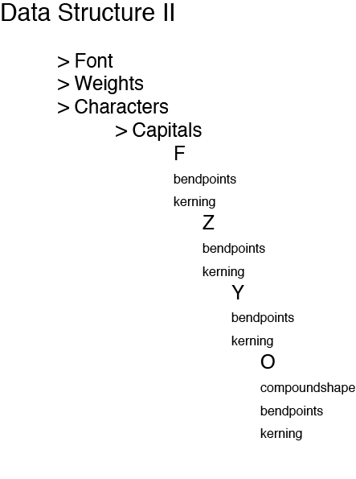

# Marianne's work for Text IO 

## Homework

Arrays and Dictionaries

[Array Subjects](Array.pv)

[Spotify-list](my_data_spotify.py)

[Dictionary Room](room.py)
[String Room](string.py)
Waarom werkt dit niet?

[Dictionary en string in 1 file](roominonefile.pv)
Werkt wel

[Group Assignment](fontdatabase.py)

Shell exercises

[Days and Months](daysmonths.rtf)

[List Months](months.rtf)

[Stegosaurus](stegosaurus.rtf)

[Edgar Allen Poe](poe.txt)

[Connections Photoshop](connections.rtf)

## Concept

## Prototype: working demo

## Design the flow of the program

## How to use the script

## PDF format 
			
