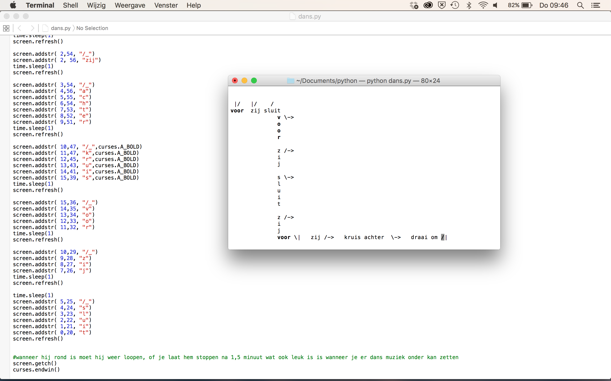
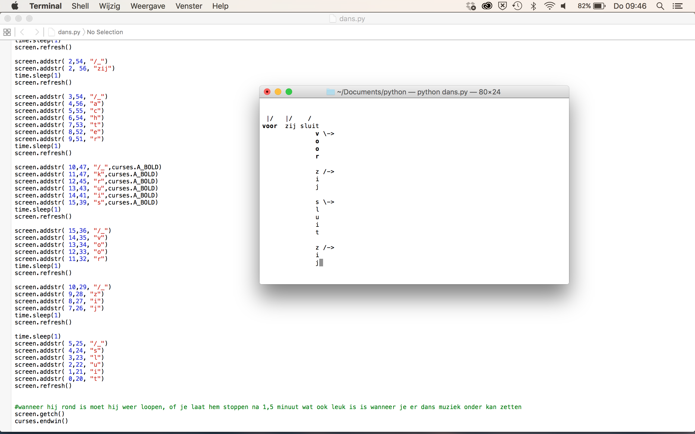

Waltz Choreographer

My tool enables you to print a waltz choreography. Where the steps re printed that are steps you have to follow, besides that you wil see little icons, they mean the following:
/ right foot action

\ left foot action

-> facing center( facing center means:  your body is turned to the other side of the floor)

_ facing wall() your body is facing the wall

| your body is in the line of dance

Also where the font is bold you have to put an accent in the dance.

you install this tool by saving the code in the texteditor program and to save it as python, then you ask in the terminal: python
waltz choreographer.py then it should print the chroreography.
 
 My tool is designed for people who don't have a lot of time and work hard, when they have a bit of time they can use this tool to practise their dance moves. A little excersize when you worked behind the computer all day.
 
dependencies: mac osx 
 
 
  
 
 
 Copyright (c) <2015> <Martijn de Lange>

Permission is hereby granted, free of charge, to any person obtaining a copy of this software and associated documentation files (the "Software"), to deal in the Software without restriction, including without limitation the rights to use, copy, modify, merge, publish, distribute, sublicense, and/or sell copies of the Software, and to permit persons to whom the Software is furnished to do so, subject to the following conditions:

The above copyright notice and this permission notice shall be included in all copies or substantial portions of the Software.

THE SOFTWARE IS PROVIDED "AS IS", WITHOUT WARRANTY OF ANY KIND, EXPRESS OR IMPLIED, INCLUDING BUT NOT LIMITED TO THE WARRANTIES OF MERCHANTABILITY, FITNESS FOR A PARTICULAR PURPOSE AND NONINFRINGEMENT. IN NO EVENT SHALL THE AUTHORS OR COPYRIGHT HOLDERS BE LIABLE FOR ANY CLAIM, DAMAGES OR OTHER LIABILITY, WHETHER IN AN ACTION OF CONTRACT, TORT OR OTHERWISE, ARISING FROM, OUT OF OR IN CONNECTION WITH THE SOFTWARE OR THE USE OR OTHER DEALINGS IN THE SOFTWARE.

 
 
 