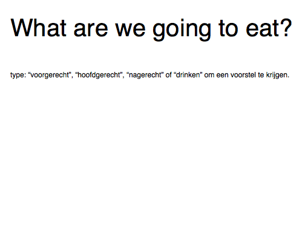
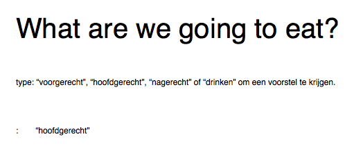
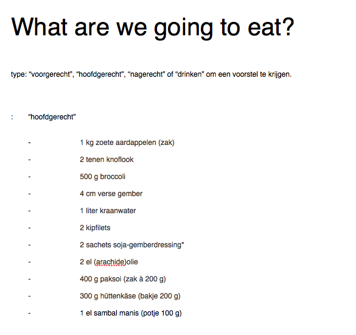

#What are we going to eat?

## Concept
 
Wat zullen we eten vanavond?
Wanneer je weer eens niet weet wat je gaat eten die avond, gebruik dit script die voor jou op een random manier bepaalt wat jij gaat eten an de hand van ingrediënten van de Albert Heijn. Vier verschillende functies; voorgerecht, hoofdgerecht, nagerecht en wat te drinken erbij. 

 
####TEXT IN:
"voorgerecht"."hoofdgerecht","nagerecht","drinken".

#####bv:
type: "hoofdgerecht"

random uitkomst:

AH rundergehakt 300 gAH mager rundergehakt 300 g

AH biologisch rundergehakt 500 g

AH gebraden gehakt naturel 125 g

AH biefstuk 2 stuks 320 g

AH biologisch pompoen per stuk

AH pompoen stukjes 400 g

######randomize:

#####-voorgerecht:
UNOX soep in pak tomatensoep met balletjes 1l

#####-hoofdgerecht: 

AH biologisch rundergehakt 500 g

AH biologisch volkoren penne rigate 500 g

AH uien duo 2 stuks

AH courgette per stuk

AH Mozzarella 125 g

#####-nagerecht:
Mona Gezingspudding griesmeel met saus 500 g

#####-drinken:
AH Zuid-afrika huiswijn fris

 
####DEMO:

            

       
Copyright (c) 2016 Max Waelbers

Permission is hereby granted, free of charge, to any person obtaining a copy of this software and associated documentation files (the "Software"), to deal in the Software without restriction, including without limitation the rights to use, copy, modify, merge, publish, distribute, sublicense, and/or sell copies of the Software, and to permit persons to whom the Software is furnished to do so, subject to the following conditions:

The above copyright notice and this permission notice shall be included in all copies or substantial portions of the Software.

THE SOFTWARE IS PROVIDED "AS IS", WITHOUT WARRANTY OF ANY KIND, EXPRESS OR IMPLIED, INCLUDING BUT NOT LIMITED TO THE WARRANTIES OF MERCHANTABILITY, FITNESS FOR A PARTICULAR PURPOSE AND NONINFRINGEMENT. IN NO EVENT SHALL THE AUTHORS OR COPYRIGHT HOLDERS BE LIABLE FOR ANY CLAIM, DAMAGES OR OTHER LIABILITY, WHETHER IN AN ACTION OF CONTRACT, TORT OR OTHERWISE, ARISING FROM, OUT OF OR IN CONNECTION WITH THE SOFTWARE OR THE USE OR OTHER DEALINGS IN THE SOFTWARE.
