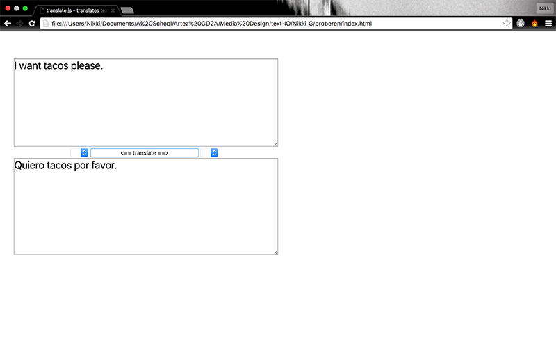

# Nikki G's work for Text IO 

## Homework
[collections]() (python code)

###Cowsay

```
Last login: Thu Dec  3 13:44:04 on ttys000
[Nikki@MacBook-Pro-van-Nikki: ~]% ruby -e "$(curl -fsSL https://raw.githubusercontent.com/Homebrew/install/master/install)"
It appears Homebrew is already installed. If your intent is to reinstall you
should do the following before running this installer again:
    ruby -e "$(curl -fsSL https://raw.githubusercontent.com/Homebrew/install/master/uninstall)"
The current contents of /usr/local are bin Cellar clamXav CODEOFCONDUCT.md CONTRIBUTING.md Library LICENSE.txt opt README.md share SUPPORTERS.md .git .gitignore
[Nikki@MacBook-Pro-van-Nikki: ~]% cowsay "Hoi"                             [73]
 _____ 
< Hoi >
 ----- 
        \   ^__^
         \  (oo)\_______
            (__)\       )\/\
                ||----w |
                ||     ||
[Nikki@MacBook-Pro-van-Nikki: ~]% cowsay -f stegosaurus "Hoi"              [74]
 _____ 
< Hoi >
 ----- 
\                             .       .
 \                           / `.   .' " 
  \                  .---.  <    > <    >  .---.
   \                 |    \  \ - ~ ~ - /  /    |
         _____          ..-~             ~-..-~
        |     |   \~~~\.'                    `./~~~/
       ---------   \__/                        \__/
      .'  O    \     /               /       \  " 
     (_____,    `._.'               |         }  \/~~~/
      `----.          /       }     |        /    \__/
            `-.      |       /      |       /      `. ,~~|
                ~-.__|      /_ - ~ ^|      /- _      `..-'   
                     |     /        |     /     ~-.     `-. _  _  _
                     |_____|        |_____|         ~ - . _ _ _ _ _>
[Nikki@MacBook-Pro-van-Nikki: ~]% 

```
### PhoneHome
```
Last login: Thu Jan  7 11:10:35 on ttys001
[Nikki@MacBook-Pro-van-Nikki: ~]% ps                                      [132]
  PID TTY           TIME CMD
97816 ttys000    0:00.21 -zsh
98060 ttys001    0:00.05 -zsh
[Nikki@MacBook-Pro-van-Nikki: ~]% ps -ax                                  [133]
  PID TTY           TIME CMD
    1 ??        29:59.50 /sbin/launchd
   50 ??         4:14.36 /usr/libexec/UserEventAgent (System)
   51 ??         7:26.32 /usr/sbin/syslogd
   54 ??         0:51.67 /usr/libexec/kextd
   55 ??        11:13.40 /System/Library/Frameworks/CoreServices.framework/Versi
   59 ??         0:04.28 /System/Library/CoreServices/appleeventsd --server
   60 ??         1:07.54 /usr/libexec/configd
   61 ??         0:35.15 /System/Library/CoreServices/powerd.bundle/powerd
   66 ??         2:04.67 /usr/libexec/airportd
   68 ??         0:02.30 /usr/libexec/warmd
   69 ??        23:22.78 /System/Library/Frameworks/CoreServices.framework/Frame
   75 ??         1:08.56 /usr/libexec/diskarbitrationd
   81 ??         2:26.18 /System/Library/CoreServices/backupd.bundle/Contents/Re
   82 ??        10:43.32 /usr/libexec/opendirectoryd
   83 ??         0:09.38 /usr/sbin/wirelessproxd
   85 ??         0:49.49 /System/Library/PrivateFrameworks/ApplePushService.fram
   86 ??         0:00.89 /Library/Application Support/Adobe/Adobe Desktop Common
   87 ??         1:01.29 /System/Library/CoreServices/launchservicesd
   89 ??         0:53.69 /usr/sbin/securityd -i
   91 ??         0:28.83 /usr/libexec/locationd
   95 ??         0:59.29 /usr/sbin/blued
   96 ??         0:00.17 autofsd
  101 ??         1:13.51 /usr/sbin/mDNSResponder
  103 ??         0:01.05 /System/Library/PrivateFrameworks/GenerationalStorage.f
  104 ??         2:16.70 /System/Library/CoreServices/loginwindow.app/Contents/M
  105 ??         0:00.27 /System/Library/CoreServices/logind
  106 ??         0:00.11 /usr/sbin/KernelEventAgent
  108 ??        21:39.47 /usr/libexec/hidd
  109 ??         0:04.41 /usr/libexec/AirPlayXPCHelper
  110 ??         1:54.48 /usr/sbin/notifyd
  111 ??         0:26.13 /System/Library/CoreServices/coreservicesd
  112 ??         2:56.70 /usr/sbin/distnoted daemon
  113 ??         2:01.40 /usr/sbin/cfprefsd daemon
  118 ??         0:02.65 /usr/libexec/taskgated -s
  119 ??         0:03.11 /System/Library/Frameworks/Security.framework/Versions/
  128 ??         0:00.10 /System/Library/Frameworks/PCSC.framework/Versions/A/XP
  164 ??        76:36.15 /usr/sbin/coreaudiod
  165 ??         1:11.22 /usr/libexec/networkd
  166 ??         0:00.31 /System/Library/CoreServices/CrashReporterSupportHelper
  168 ??       353:18.09 /System/Library/Frameworks/ApplicationServices.framewor
  186 ??         0:20.45 /usr/libexec/lsd runAsRoot
  197 ??        18:23.21 /System/Library/CoreServices/backupd.bundle/Contents/Re
  200 ??         0:34.50 /usr/sbin/ntpd -c /private/etc/ntp-restrict.conf -n -g 
  201 ??         0:01.11 /usr/libexec/corestoraged
  203 ??         0:08.76 /usr/libexec/usbd
  208 ??         0:01.60 /usr/libexec/thermald
  218 ??         6:51.69 /usr/libexec/symptomsd
  224 ??         0:01.47 /System/Library/Frameworks/OpenGL.framework/Versions/A/
  237 ??        14:11.39 /System/Library/Frameworks/CoreServices.framework/Frame
  256 ??         1:19.18 /usr/libexec/securityd_service
  257 ??         0:44.46 /usr/libexec/UserEventAgent (Aqua)
  259 ??        14:17.78 /usr/sbin/distnoted agent
  262 ??         0:42.90 /System/Library/Frameworks/CoreTelephony.framework/Supp
  264 ??         0:12.51 /usr/libexec/lsd
  268 ??         0:25.97 /System/Library/PrivateFrameworks/IDS.framework/identit
  271 ??         6:53.48 /System/Library/PrivateFrameworks/CalendarAgent.framewo
  282 ??         0:00.58 /System/Library/PrivateFrameworks/AskPermission.framewo
  290 ??         0:33.62 /usr/sbin/usernoted
  292 ??         0:07.42 /usr/libexec/watchdogd
  299 ??         0:13.84 /System/Library/PrivateFrameworks/CommerceKit.framework
  301 ??         0:05.36 /System/Library/PrivateFrameworks/IMCore.framework/imag
  308 ??         0:01.40 /System/Library/CoreServices/backupd.bundle/Contents/Re
  309 ??         0:01.70 /System/Library/PrivateFrameworks/PackageKit.framework/
  313 ??         0:54.46 /System/Library/PrivateFrameworks/UserActivity.framewor
  315 ??         0:22.94 /usr/libexec/sharingd
  316 ??         0:02.08 /System/Library/CoreServices/sharedfilelistd --enable-l
  320 ??         0:05.89 /System/Library/CoreServices/sharedfilelistd
  325 ??         1:21.94 /System/Library/Frameworks/ApplicationServices.framewor
  345 ??         0:00.04 /usr/sbin/pboard
  461 ??         0:06.09 /System/Library/Frameworks/CoreServices.framework/Frame
  468 ??         0:14.27 /System/Library/Frameworks/CoreServices.framework/Frame
  481 ??         0:01.97 /usr/sbin/filecoordinationd
  484 ??         0:01.59 /System/Library/PrivateFrameworks/DataDetectorsCore.fra
  522 ??         0:00.00 /Applications/Utilities/Adobe Creative Cloud/ACC/Creati
  523 ??        17:30.71 /Applications/Mail.app/Contents/MacOS/Mail -psn_0_11881
  524 ??         2:25.74 /System/Library/CoreServices/Dock.app/Contents/MacOS/Do
  526 ??         3:37.26 /System/Library/CoreServices/SystemUIServer.app/Content
  530 ??         0:57.17 /System/Library/PrivateFrameworks/CommerceKit.framework
  537 ??         0:03.43 /System/Library/CoreServices/Dock.app/Contents/XPCServi
  538 ??         0:02.86 /System/Library/PrivateFrameworks/CommerceKit.framework
  542 ??         0:46.28 /System/Library/CoreServices/Spotlight.app/Contents/Mac
  545 ??         0:06.34 /System/Library/PrivateFrameworks/CoreWLANKit.framework
  549 ??         0:00.41 /System/Library/PrivateFrameworks/CommerceKit.framework
  552 ??         0:08.99 /System/Library/PrivateFrameworks/ParsecUI.framework/Ve
  556 ??         0:03.31 /System/Library/CoreServices/SocialPushAgent.app/Conten
  558 ??         0:02.45 /System/Library/CoreServices/Keychain Circle Notificati
  561 ??         0:25.68 /System/Library/CoreServices/NotificationCenter.app/Con
  563 ??         0:01.41 /System/Library/Image Capture/Support/icdd
  569 ??         0:07.24 /System/Library/CoreServices/cloudpaird
  572 ??         0:03.74 /System/Library/CoreServices/WiFiAgent.app/Contents/Mac
  573 ??         0:05.40 /System/Library/CoreServices/diagnostics_agent
  584 ??         4:29.21 /Applications/Utilities/Adobe Application Manager/IPC/A
  593 ??         0:07.53 /System/Library/Services/AppleSpell.service/Contents/Ma
  596 ??        11:20.76 /Library/Application Support/Adobe/Adobe Desktop Common
  598 ??         8:05.38 /Library/Application Support/Adobe/Adobe Desktop Common
  603 ??        16:19.97 /Applications/Utilities/Adobe Creative Cloud/CoreSync/C
  604 ??         1:52.09 /Applications/Utilities/Adobe Creative Cloud/CCXProcess
  605 ??         8:06.69 /Applications/Utilities/Adobe Creative Cloud/CoreSync/C
  611 ??         0:00.28 /System/Library/PrivateFrameworks/CommerceKit.framework
  614 ??         0:48.81 /Applications/Utilities/Adobe Creative Cloud/CCLibrary/
  620 ??         1:16.16 /System/Library/CoreServices/SubmitDiagInfo server-init
  621 ??         0:02.53 /System/Library/PrivateFrameworks/CommerceKit.framework
  645 ??         0:00.28 /System/Library/PrivateFrameworks/KerberosHelper/Helper
  657 ??         0:01.91 /System/Library/Frameworks/CoreServices.framework/Frame
  805 ??         0:00.88 /Applications/iTunes.app/Contents/MacOS/iTunesHelper.ap
  838 ??         0:00.76 /System/Library/PrivateFrameworks/MobileDevice.framewor
  890 ??       696:05.93 /Applications/Google Chrome.app/Contents/MacOS/Google C
  892 ??         0:00.85 /Applications/Google Chrome.app/Contents/Versions/47.0.
  893 ??       246:22.37 /Applications/Google Chrome.app/Contents/Versions/47.0.
  899 ??         0:09.16 /Applications/Google Chrome.app/Contents/Versions/47.0.
  901 ??        53:28.84 /Applications/Google Chrome.app/Contents/Versions/47.0.
  926 ??         0:00.25 /usr/libexec/USBAgent
 1335 ??         0:00.03 /System/Library/Frameworks/CoreServices.framework/Frame
 1358 ??         0:05.09 /System/Library/PrivateFrameworks/Noticeboard.framework
 1454 ??         0:00.19 /System/Library/PrivateFrameworks/Noticeboard.framework
 1461 ??         0:00.76 /System/Library/Filesystems/AppleShare/check_afp.app/Co
 1470 ??         0:00.28 /System/Library/PrivateFrameworks/DiskImages.framework/
 1569 ??         0:04.79 /System/Library/PrivateFrameworks/DiskImages.framework/
11026 ??         0:00.20 /System/Library/Frameworks/CoreServices.framework/Frame
11132 ??         0:00.59 /usr/libexec/syspolicyd
20842 ??         0:03.03 /System/Library/PrivateFrameworks/DiskImages.framework/
23907 ??         1:43.47 /Library/CoreMediaIO/Plug-Ins/DAL/AppleCamera.plugin/Co
24488 ??         6:20.78 /Applications/Google Chrome.app/Contents/Versions/47.0.
27661 ??         0:01.01 /System/Library/Frameworks/ApplicationServices.framewor
27911 ??        13:04.66 /System/Library/CoreServices/Finder.app/Contents/MacOS/
27913 ??         0:02.29 /Applications/Utilities/Adobe Creative Cloud/CoreSync/C
27918 ??         0:00.55 /Library/Application Support/Adobe/Adobe Desktop Common
27938 ??         0:00.90 /System/Library/PrivateFrameworks/DiskImages.framework/
27989 ??         0:00.29 /System/Library/PrivateFrameworks/DiskImages.framework/
28982 ??         0:00.90 /System/Library/PrivateFrameworks/DiskImages.framework/
29016 ??         0:00.31 /System/Library/PrivateFrameworks/DiskImages.framework/
32771 ??         0:00.40 /System/Library/PrivateFrameworks/DiskImages.framework/
32812 ??         0:01.12 /System/Library/PrivateFrameworks/DiskImages.framework/
32842 ??         0:00.65 /System/Library/PrivateFrameworks/DiskImages.framework/
32883 ??         0:01.10 /System/Library/PrivateFrameworks/DiskImages.framework/
33018 ??         7:00.56 /System/Library/CoreServices/backupd.bundle/Contents/Re
33295 ??       347:15.19 /Applications/Google Chrome.app/Contents/Versions/47.0.
33639 ??       209:29.49 /Applications/Google Chrome.app/Contents/Versions/47.0.
37866 ??         0:01.56 /usr/bin/ssh-agent -l
59168 ??         0:04.04 /System/Library/PrivateFrameworks/GeoServices.framework
68333 ??         0:11.46 /System/Library/PrivateFrameworks/PhotoLibraryPrivate.f
68336 ??         0:00.49 /System/Library/PrivateFrameworks/PhotoLibraryPrivate.f
68569 ??         0:00.03 /System/Library/Frameworks/CoreServices.framework/Frame
72262 ??         0:41.92 /System/Library/Frameworks/VideoToolbox.framework/Versi
79455 ??         0:03.52 /System/Library/Frameworks/CoreMediaIO.framework/Resour
79557 ??         0:00.70 /usr/libexec/diagnosticd
79563 ??         0:03.87 /usr/libexec/nsurlstoraged
79567 ??         0:00.79 /usr/sbin/WirelessRadioManagerd
79573 ??         0:01.23 /usr/libexec/pkd
79575 ??         0:00.58 /System/Library/CoreServices/backupd.bundle/Contents/Re
79576 ??         0:00.39 /usr/sbin/cfprefsd agent
79579 ??         0:10.92 /usr/libexec/coreduetd
79580 ??         0:19.63 /usr/sbin/cfprefsd agent
79581 ??         0:01.55 /System/Library/PrivateFrameworks/MessagesKit.framework
79582 ??         0:01.95 /usr/libexec/secinitd
79583 ??         0:01.27 /System/Library/PrivateFrameworks/TCC.framework/Resourc
79584 ??         0:02.36 /System/Library/Frameworks/AddressBook.framework/Versio
79585 ??         0:41.63 /System/Library/Frameworks/Accounts.framework/Versions/
79587 ??         0:00.70 /System/Library/PrivateFrameworks/AuthKit.framework/Ver
79588 ??         0:00.07 /usr/libexec/networkd_privileged
79589 ??         0:00.82 /System/Library/CoreServices/AirPlayUIAgent.app/Content
79590 ??         0:00.48 /System/Library/Frameworks/Security.framework/Versions/
79591 ??         0:00.75 /usr/libexec/secd
79592 ??         0:00.06 /System/Library/Frameworks/Security.framework/Versions/
79593 ??         0:00.05 /System/Library/Frameworks/Security.framework/Versions/
79596 ??         0:36.01 /usr/libexec/systemstatsd
79601 ??         0:05.95 sysmond
79602 ??         0:09.19 /System/Library/PrivateFrameworks/CoreSuggestions.frame
79636 ??         0:00.21 /System/Library/PrivateFrameworks/PerformanceAnalysis.f
79639 ??         0:01.20 /System/Library/PrivateFrameworks/WirelessDiagnostics.f
79640 ??         0:02.90 /System/Library/CoreServices/iconservicesagent
79641 ??         0:00.20 /System/Library/CoreServices/iconservicesd
79642 ??         0:00.55 /System/Library/CoreServices/ScopedBookmarkAgent
79646 ??         0:00.04 /System/Library/CryptoTokenKit/com.apple.ifdreader.slot
79648 ??         0:20.30 /System/Library/PrivateFrameworks/CalendarAgent.framewo
79655 ??         0:00.53 /System/Library/Frameworks/GSS.framework/Helpers/com.ap
79699 ??         0:11.04 /System/Library/PrivateFrameworks/AmbientDisplay.framew
79717 ??         0:00.04 /System/Library/PrivateFrameworks/AccountPolicy.framewo
79719 ??         0:00.10 /System/Library/CoreServices/pbs
79724 ??         0:00.16 /System/Library/PrivateFrameworks/CoreRecents.framework
79727 ??         0:01.08 /System/Library/PrivateFrameworks/CoreSpotlight.framewo
79728 ??         0:01.36 /usr/libexec/sandboxd
79729 ??         0:00.49 /System/Library/PrivateFrameworks/CoreSymbolication.fra
79730 ??         0:00.12 /System/Library/PrivateFrameworks/CoreSuggestions.frame
79732 ??         0:00.41 /usr/sbin/systemsoundserverd
79733 ??         0:00.02 /System/Library/Frameworks/AudioToolbox.framework/XPCSe
79740 ??         0:00.14 /System/Library/Frameworks/InputMethodKit.framework/Ver
79741 ??         0:00.28 /System/Library/PrivateFrameworks/CloudDocsDaemon.frame
79771 ??         0:03.61 /System/Library/PrivateFrameworks/ViewBridge.framework/
79772 ??         0:00.08 /System/Library/PrivateFrameworks/TCC.framework/Resourc
79810 ??         0:02.07 /System/Library/PrivateFrameworks/CommerceKit.framework
79821 ??         0:01.77 /System/Library/PrivateFrameworks/CacheDelete.framework
79822 ??         0:01.28 aslmanager
79832 ??         0:05.00 /usr/libexec/amfid
79864 ??         0:00.19 /usr/libexec/swcd
79893 ??         0:00.14 /usr/sbin/spindump
79903 ??         0:04.34 /usr/sbin/distnoted agent
79907 ??         0:02.87 /System/Library/LoginPlugins/BezelServices.loginPlugin/
79914 ??         0:00.06 /usr/libexec/spindump_agent
81554 ??         0:00.09 /System/Library/Frameworks/InputMethodKit.framework/Res
84244 ??         0:03.57 /usr/sbin/distnoted agent
84380 ??         0:18.27 /System/Library/PrivateFrameworks/SafariSafeBrowsing.fr
84381 ??         0:29.67 /System/Library/CoreServices/Software Update.app/Conten
84382 ??         0:00.13 /System/Library/PrivateFrameworks/SoftwareUpdate.framew
84388 ??         0:00.61 /System/Library/CoreServices/mapspushd
85859 ??         0:00.55 /System/Library/CoreServices/AppleIDAuthAgent
86176 ??         0:00.12 /System/Library/Frameworks/ApplicationServices.framewor
86571 ??         0:00.04 /System/Library/Frameworks/DiskArbitration.framework/Ve
86856 ??         0:00.04 /System/Library/PrivateFrameworks/CommunicationsFilter.
86860 ??         0:01.60 /System/Library/PrivateFrameworks/TelephonyUtilities.fr
86861 ??         0:00.03 /System/Library/Frameworks/CoreMediaIO.framework/Versio
86862 ??         0:00.29 /System/Library/PrivateFrameworks/IMFoundation.framewor
86864 ??         0:00.03 /System/Library/PrivateFrameworks/ToneLibrary.framework
86869 ??         0:00.74 /usr/libexec/rtcreportingd
86872 ??         0:00.42 /System/Library/PrivateFrameworks/CallHistory.framework
87209 ??         0:00.10 /System/Library/PrivateFrameworks/CallHistory.framework
87210 ??         0:03.91 /System/Library/PrivateFrameworks/CloudKitDaemon.framew
87211 ??         0:00.12 /usr/libexec/nsurlsessiond
87212 ??         0:00.35 /usr/libexec/nsurlsessiond --privileged
87925 ??         0:00.07 /System/Library/Frameworks/AddressBook.framework/Versio
88221 ??         0:00.33 /System/Library/CoreServices/EscrowSecurityAlert.app/Co
88248 ??         0:00.01 /usr/libexec/periodic-wrapper daily
88275 ??         0:00.07 /usr/libexec/nsurlstoraged
88319 ??         0:00.09 /usr/libexec/diskmanagementd
88332 ??         0:00.31 /System/Library/CoreServices/Software Update.app/Conten
88333 ??         0:00.35 /System/Library/PrivateFrameworks/AssetCacheServices.fr
88334 ??         0:00.02 /System/Library/PrivateFrameworks/TCC.framework/Resourc
88335 ??         0:00.09 /usr/libexec/nehelper
88338 ??         0:01.96 /System/Library/PrivateFrameworks/PackageKit.framework/
89601 ??         0:01.66 /Applications/Preview.app/Contents/MacOS/Preview -psn_0
89602 ??         0:00.07 /System/Library/PrivateFrameworks/BookKit.framework/Ver
89605 ??         0:03.70 /System/Library/Image Capture/Support/Image Capture Ext
90005 ??         0:00.32 /System/Library/PrivateFrameworks/CloudPhotoServices.fr
90010 ??         0:02.80 /System/Library/CoreServices/cloudphotosd.app/Contents/
90013 ??         0:00.13 /System/Library/CoreServices/cloudphotosd.app/Contents/
90026 ??         0:00.08 /System/Library/PrivateFrameworks/PhotoLibrary.framewor
90027 ??         0:00.22 /System/Library/PrivateFrameworks/AssetCacheServices.fr
90041 ??         0:00.23 /System/Library/PrivateFrameworks/PhotoLibraryPrivate.f
91460 ??         0:18.77 /usr/libexec/SafariCloudHistoryPushAgent
92180 ??         0:06.24 /System/Library/CoreServices/NetAuthAgent.app/Contents/
94237 ??         0:00.04 /System/Library/PrivateFrameworks/SafariServices.framew
94595 ??         0:00.19 /System/Library/PrivateFrameworks/SafariShared.framewor
94610 ??         0:00.02 /System/Library/Frameworks/ApplicationServices.framewor
94772 ??         4:01.49 /Users/Nikki/Downloads/Mou.app/Contents/MacOS/Mou
94828 ??         1:35.95 /Applications/GitHub Desktop.app/Contents/MacOS/GitHub 
97542 ??         0:00.20 /System/Library/CoreServices/CoreServicesUIAgent.app/Co
97557 ??         0:00.93 /System/Library/Frameworks/CoreServices.framework/Frame
97561 ??         0:00.87 /System/Library/Frameworks/CoreServices.framework/Frame
97562 ??         0:00.83 /System/Library/Frameworks/CoreServices.framework/Frame
97563 ??         0:01.08 /System/Library/Frameworks/CoreServices.framework/Frame
97580 ??         0:00.15 /System/Library/Frameworks/CoreServices.framework/Frame
97610 ??         0:00.03 /usr/sbin/netbiosd
97621 ??         0:49.35 /Applications/Google Chrome.app/Contents/Versions/47.0.
97632 ??        16:55.47 /Applications/Adobe Premiere Pro CC 2015/Adobe Premiere
97640 ??         0:02.51 /System/Library/Image Capture/Devices/MassStorageCamera
97641 ??         0:02.62 /Applications/Adobe Premiere Pro CC 2015/Adobe Premiere
97645 ??         0:00.33 /Applications/Adobe Premiere Pro CC 2015/Adobe Premiere
97647 ??         0:00.73 /Applications/Adobe Premiere Pro CC 2015/Adobe Premiere
97662 ??         0:00.00 (sh)
97672 ??         0:00.00 (sh)
97674 ??         0:00.70 /Applications/Adobe Premiere Pro CC 2015/Adobe Premiere
97677 ??         0:01.17 /Applications/Adobe Premiere Pro CC 2015/Adobe Premiere
97678 ??         0:03.73 /Applications/Adobe Premiere Pro CC 2015/Adobe Premiere
97738 ??         0:00.02 /System/Library/Frameworks/AudioToolbox.framework/XPCSe
97739 ??         0:00.07 /System/Library/Frameworks/AudioToolbox.framework/XPCSe
97814 ??         0:08.82 /Applications/Utilities/Terminal.app/Contents/MacOS/Ter
97872 ??         0:00.08 /System/Library/Frameworks/CoreServices.framework/Frame
97957 ??         0:00.06 /System/Library/PrivateFrameworks/AOSKit.framework/Vers
97964 ??         0:00.03 /usr/sbin/ocspd
97980 ??         0:00.05 /System/Library/Frameworks/CoreServices.framework/Frame
97981 ??         0:00.07 /System/Library/Frameworks/CoreServices.framework/Frame
97982 ??         0:00.05 /System/Library/Frameworks/CoreServices.framework/Frame
97983 ??         0:00.04 /System/Library/Frameworks/CoreServices.framework/Frame
97984 ??         0:00.04 /System/Library/Frameworks/CoreServices.framework/Frame
97985 ??         0:00.04 /System/Library/Frameworks/CoreServices.framework/Frame
97986 ??         0:00.04 /System/Library/Frameworks/CoreServices.framework/Frame
97987 ??         0:00.01 /System/Library/Frameworks/AudioToolbox.framework/XPCSe
97988 ??         0:00.02 /System/Library/Frameworks/AudioToolbox.framework/XPCSe
97993 ??         0:01.19 /System/Library/Frameworks/QuickLook.framework/Resource
97994 ??         0:03.03 /System/Library/Frameworks/QuickLook.framework/Versions
97995 ??         0:00.11 /Library/Frameworks/iTunesLibrary.framework/Versions/A/
97996 ??         0:00.01 /System/Library/Frameworks/AudioToolbox.framework/XPCSe
97997 ??         0:00.02 /System/Library/Frameworks/AudioToolbox.framework/XPCSe
97815 ttys000    0:02.12 login -pf Nikki /bin/zsh
97816 ttys000    0:00.21 -zsh
98059 ttys001    0:00.02 login -pf Nikki /bin/zsh
98060 ttys001    0:00.05 -zsh
98089 ttys001    0:00.00 ps -ax
[Nikki@MacBook-Pro-van-Nikki: ~]% netstat -a | grep 'adobe'               [134]
84a31b3467a499a7 stream      0      0                0 84a31b3468d990af                0                0 /tmp/com.adobe.AdobeIPCBroker.ctrl-Nikki
84a31b34569c042f stream      0      0                0 84a31b3468d98e57                0                0 /tmp/com.adobe.AdobeIPCBroker.ctrl-Nikki
84a31b346a9c9307 stream      0      0                0 84a31b346a9c84f7                0                0 /tmp/com.adobe.AdobeIPCBroker.ctrl-Nikki
84a31b346a9c8d8f stream      0      0                0 84a31b346a9c8f1f                0                0 /tmp/com.adobe.AdobeIPCBroker.ctrl-Nikki
84a31b346a740b97 stream      0      0                0 84a31b346a740c5f                0                0 /tmp/com.adobe.AdobeIPCBroker.ctrl-Nikki
84a31b346a740d27 stream      0      0                0 84a31b346a740def                0                0 /tmp/com.adobe.AdobeIPCBroker.ctrl-Nikki
84a31b346a7414f7 stream      0      0                0 84a31b346a74110f                0                0 /tmp/com.adobe.AdobeIPCBroker.ctrl-Nikki
84a31b346a74142f stream      0      0                0 84a31b346a741367                0                0 /tmp/com.adobe.AdobeIPCBroker.ctrl-Nikki
84a31b3468d99497 stream      0      0                0 84a31b3468d993cf                0                0 /tmp/com.adobe.AdobeIPCBroker.ctrl-Nikki
84a31b3468d96e4f stream      0      0                0 84a31b3468d99307                0                0 /tmp/com.adobe.AdobeIPCBroker.ctrl-Nikki
84a31b3468d98d8f stream      0      0 84a31b3457cbfe4f                0                0                0 /tmp/com.adobe.AdobeIPCBroker.ctrl-Nikki
[Nikki@MacBook-Pro-van-Nikki: ~]%   
```


### Array
```
a = ["Filosofie", "Fotografie", "Design Reaserch", "Annie", "Computer Skills", "Media Design", "Typografie", "Grafisch"]
print len(a)

a + ["Media Theorie"]

#a.append("Media Theorie")

print len (a)

a.pop(7)
print len (a)

a.pop(3)
print len (a)

print a[4]


print a
```

###Dictonairy
```
d = { 'adres':19, 'oppervlakte kamer': "21 m2", 'hoogte kamer': "3,2 m", 'bedgrootte': "2persoons 160cm bij 200 cm", 'merk printer': "Epson XP-950"}

print 'adres'    
```

### Kamer

```
kamer = {
	'kamer': [
	{
		'plaats': "Arnhem", 
		'straat naam': 'Kastanjelaan 17' , 
		'postcode': '6828 GH',
		'huisnummer':17,
	},

	{
		'opp':21 ,
		'hoogte':3.10 , 
		'lengte':3.50 , 
		'breedte':6, 
	},

	{
		'interieur': [
			{'banken':0 },
			{'bureaus': 1 },
			{'kasten': 1},
			{'deur': 2 },
			{'ramen': 2},
			]
	},
	
	],

	}


```


###Itunes

```
Itunens = {
	'Caracal (Deluxe)': [
	{ 
		'artist': "Disclosure",
		'year':2015, 
		'songs': [
		{'title1': 'nocturnal', 'time': 6.44},
		{'title2': 'omen', 'time': 3.50},
		{'title3': 'holding on', 'time': 5.15},
		{'title4': 'willing & able', 'time': 4.52},
		{'title5': 'magnets', 'time': 3.19},
		{'title6': 'jaded', 'time': 4.33},
		{'title7': 'good itentions', 'time': 4.42},
		{'title8': 'superego', 'time': 4.33},
		{'title9': 'hourglass', 'time': 5.24},
		{'title10': 'echoes', 'time': 5.09},
		{'title11': 'masterpiece', 'time': 4.01},
		{'title12': 'molecules', 'time': 3.56},
		{'title13': 'moving mountains', 'time': 5.35},
		{'title14': 'bang that', 'time': 4.48},
		{'title15': 'afterthought', 'time': 5.20},
		]
	},

	
	],
}

```

```
import itunes.py 

d = Itunes.data

print "Mijn lievelings liedje is %s met de duur van %d minuten" % (d ['title14'], d ['time14'])

UITKOMST

Last login: Wed Dec  9 14:49:38 on ttys001
[Nikki@MacBook-Pro-van-Nikki: ~]% cd/Users/Nikki/Documents/A\ School/Artez\ GD2A/Media\ Design/Zelf\ Text 
zsh: command not found: cd/Users/Nikki/Documents/A School/Artez GD2A/Media Design/Zelf Text
[Nikki@MacBook-Pro-van-Nikki: ~]% cd Documents                            [109]
[Nikki@MacBook-Pro-van-Nikki: ~/Documents]% cd /Users/Nikki/Documents/A\ School/Artez\ GD2A/Media\ Design/Zelf\ Text 
[Nikki@MacBook-Pro-van-Nikki: Artez GD2A/Media Design/Zelf Text]% python itunes_data.py
Traceback (most recent call last):
  File "itunes_data.py", line 1, in <module>
    import itunes.py 
  File "/Users/Nikki/Documents/A School/Artez GD2A/Media Design/Zelf Text/itunes.py", line 8
    {'title2': "omen', 'time": 3.50},
                             ^
SyntaxError: invalid syntax
[Nikki@MacBook-Pro-van-Nikki: Artez GD2A/Media Design/Zelf Text]% python itunes_data.py
Traceback (most recent call last):
  File "itunes_data.py", line 1, in <module>
    import itunes.py 
  File "/Users/Nikki/Documents/A School/Artez GD2A/Media Design/Zelf Text/itunes.py", line 8
    {'title2': "omen', 'time2": 3.50},
                              ^
SyntaxError: invalid syntax
[Nikki@MacBook-Pro-van-Nikki: Artez GD2A/Media Design/Zelf Text]%  
```


### Poe
```
"Last login: Wed Dec  2 13:22:37 on ttys000
[Nikki@MacBook-Pro-van-Nikki: ~]% cd Documents/A\ School/Artez\ GD2A/Media\ Design/Huiswerk\ 3\ dec 
[Nikki@MacBook-Pro-van-Nikki: ~]% curl http://www.gutenberg.org/files/2147/2147-8.txt > vol1.txt
  % Total    % Received % Xferd  Average Speed   Time    Time     Time  Current
                                 Dload  Upload   Total   Spent    Left  Speed
100  537k  100  537k    0     0   313k      0  0:00:01  0:00:01 --:--:--  
[Nikki@MacBook-Pro-van-Nikki: ~]% curl http://www.gutenberg.org/files/2148/2148-8.txt > vol2.txt
  % Total    % Received % Xferd  Average Speed   Time    Time     Time  Current
                                 Dload  Upload   Total   Spent    Left  Speed
100  537k  100  537k    0     0   313k      0  0:00:01  0:00:01 --:--:--  313k 313k
[Nikki@MacBook-Pro-van-Nikki: ~]% curl http://www.gutenberg.org/files/2149/2149-8.txt > vol3.txt
  % Total    % Received % Xferd  Average Speed   Time    Time     Time  Current
                                 Dload  Upload   Total   Spent    Left  Speed
100  537k  100  537k    0     0   313k      0  0:00:01  0:00:01 --:--:--  313k
[Nikki@MacBook-Pro-van-Nikki: ~]% curl http://www.gutenberg.org/files/2147/2147-8.txt > vol4.txt
  % Total    % Received % Xferd  Average Speed   Time    Time     Time  Current
                                 Dload  Upload   Total   Spent    Left  Speed
100  537k  100  537k    0     0   313k      0  0:00:01  0:00:01 --:--:--  313k
[Nikki@MacBook-Pro-van-Nikki: ~]% curl http://www.gutenberg.org/files/2147/2147-8.txt > vol5.txt
  % Total    % Received % Xferd  Average Speed   Time    Time     Time  Current
                                 Dload  Upload   Total   Spent    Left  Speed
100  537k  100  537k    0     0   313k      0  0:00:01  0:00:01 --:--:--  313k
[Nikki@MacBook-Pro-van-Nikki: Artez GD2A/Media Design/Huiswerk 3 dec]% mkdir Poe
[Nikki@MacBook-Pro-van-Nikki: Artez GD2A/Media Design/Huiswerk 3 dec]% mv .txt Poe
mv: rename .txt to Poe/.txt: No such file or directory
[Nikki@MacBook-Pro-van-Nikki: Artez GD2A/Media Design/Huiswerk 3 dec]% mv *.txt Poe
[Nikki@MacBook-Pro-van-Nikki: Artez GD2A/Media Design/Huiswerk 3 dec]% l   [60]
total 0
drwxr-xr-x  7 Nikki  staff   238B Dec  2 13:30 Poe/
[Nikki@MacBook-Pro-van-Nikki: Artez GD2A/Media Design/Huiswerk 3 dec]% cd Poe 
[Nikki@MacBook-Pro-van-Nikki: Media Design/Huiswerk 3 dec/Poe]% grep -c 'dog' .txt
egrep: .txt: No such file or directory
[Nikki@MacBook-Pro-van-Nikki: Media Design/Huiswerk 3 dec/Poe]% grep -c 'dog' *.txt
vol1.txt:10
vol2.txt:17
vol3.txt:19
vol4.txt:25
vol5.txt:13
[Nikki@MacBook-Pro-van-Nikki: Media Design/Huiswerk 3 dec/Poe]% grep -c 'cat' *.txt
vol1.txt:132
vol2.txt:134
vol3.txt:79
vol4.txt:110
vol5.txt:74
[Nikki@MacBook-Pro-van-Nikki: Media Design/Huiswerk 3 dec/Poe]% grep -n 'horror' *.txt
vol1.txt:591:subtle ramifications of its roots. In raising images of horror, also,\
vol1.txt:593:some terrible _doubt _which is the secret of all horror. He leaves to\
vol1.txt:617:the unreal as sources of effect. They have not used dread and horror\
vol1.txt:1375:any adequate idea of the horror of my situation. I gasped convulsively\
vol1.txt:1400:nor horror-stricken. If I felt any emotion at all, it was a kind of\
vol1.txt:1445:die rapidly away, and thereunto succeeded horror, and dismay, and a\
vol1.txt:2341:can give any adequate idea of the extreme, the absolute horror and\
vol1.txt:5011:every one present not less with horror than with astonishment.\
vol1.txt:5335:horror of the thing. But dismiss the idle opinions of this print. It\
vol1.txt:5673:brutal, a butchery without motive, a _grotesquerie_ in horror absolutely\
vol1.txt:5728:to all. I understood the full horrors of the murder at once.\
vol1.txt:5942:fell from his hold through excess of horror. Now it was that those\
vol1.txt:5967:horror, was just discernible. The fury of the beast, who no doubt bore\
vol1.txt:5982:Frenchman's exclamations of horror and affright, commingled with the\
vol1.txt:7604:in fact, a secret. The horrors of this dark deed are known only to one,\
vol1.txt:7701:unutterable horror at finding that the boat has been picked up and\
vol1.txt:8483:attended us. All around were horror, and thick gloom, and a black\
vol1.txt:8521:mainly inspired us with horror and astonishment, was that she bore up\
vol1.txt:8719:To conceive the horror of my sensations is, I presume, utterly\
vol1.txt:8736:horror upon horror! the ice opens suddenly to the right, and to the\
vol2.txt:1543:of the magnificence, or of the horror of the scene--or of the wild\
vol2.txt:1744:horror--for he put his mouth close to my ear, and screamed out the word\
vol2.txt:1801:the place at all. As it was, I involuntarily closed my eyes in horror.\
vol2.txt:1883:"Never shall I forget the sensations of awe, horror, and admiration with\
vol2.txt:2023:removed) speechless from the memory of its horror. Those who drew me on\
vol2.txt:2979:then present had been unaccustomed to death-bed horrors; but so hideous\
vol2.txt:3015:unutterable, shuddering horror which these few words, thus uttered, were\
vol2.txt:3181:the night's debauch--I experienced a sentiment half of horror, half of\
vol2.txt:3317:and horror with which the animal inspired me, had been heightened by one\
vol2.txt:3446:howl--a wailing shriek, half of horror and half of triumph, such as\
vol2.txt:3664:instruments, which did not inspire him with horror.\
vol2.txt:3913:horror, we partially turned aside the yet unscrewed lid of the coffin,\
vol2.txt:3963:intense sentiment of horror, unaccountable yet unendurable, I threw on\
vol2.txt:4292:redness and the horror of blood. There were sharp pains, and sudden\
vol2.txt:4432:surprise--then, finally, of terror, of horror, and of disgust.\
vol2.txt:4451:was besprinkled with the scarlet horror.\
vol2.txt:4496:horror at finding the grave-cerements and corpse-like mask which they\
vol2.txt:4949:horror become merged in a cloud of unnamable feeling. By gradations,\
vol2.txt:4956:delight of its horror. It is merely the idea of what would be our\
vol2.txt:5722:delirious horror, the soft and nearly imperceptible waving of the sable\
vol2.txt:5772:interminableness of the descent. They tell also of a vague horror at\
vol2.txt:5833:thronging upon my recollection a thousand vague rumors of the horrors of\
vol2.txt:5909:or death with its most hideous moral horrors. I had been reserved for\
vol2.txt:5973:my side on the floor. I saw, to my horror, that the pitcher had been\
vol2.txt:5974:removed. I say to my horror; for I was consumed with intolerable thirst.\
vol2.txt:6004:idea that had perceptibly descended. I now observed--with what horror it\
vol2.txt:6014:agents--the pit whose horrors had been destined for so bold a recusant\
vol2.txt:6024:What boots it to tell of the long, long hours of horror more than\
vol2.txt:6164:my wooden bed of horror upon the stone floor of the prison, when the\
vol2.txt:6196:A richer tint of crimson diffused itself over the pictured horrors of\
vol2.txt:6206:reason.--Oh! for a voice to speak!--oh! horror!--oh! any horror but\
vol2.txt:6407:no sooner was he awake than he became fully aware of the awful horrors\
vol2.txt:6490:which still palpitates, a degree of appalling and intolerable horror\
vol2.txt:6558:the grim Darkness overspread the Earth, then, with every horror of\
vol2.txt:6615:unstrung, and I fell a prey to perpetual horror. I hesitated to ride, or\
vol2.txt:7785:been already too much an object for the scorn--for the horror--for the\
vol2.txt:7812:am I not now dying a victim to the horror and the mystery of the wildest\
vol2.txt:8156:possessed with an objectless yet intolerable horror. Gasping for\
vol2.txt:8354:I say that I felt all the horrors of the damned? Most assuredly I had\
vol2.txt:8400:from Oxford to the continent, in a perfect agony of horror and of shame.\
vol2.txt:8499:astonishment, that horror which possessed me at the spectacle then\
vol2.txt:8706:horror!-this I thought, and this I think. But anything was better than\
vol2.txt:8966:dreams a cry as of horror and dismay; and thereunto, after a pause,\
vol2.txt:8982:comprehension. Yet its memory was replete with horror--horror more\
vol2.txt:9160:involved a penalty the exceeding great horror of which will not permit\
vol3.txt:754:description. Every species of calamity and horror befell me. Among other\
vol3.txt:905:My sensations were those of extreme horror and dismay. In vain I\
vol3.txt:1094:horror with which I was inspired by the fragmentary warning thus\
vol3.txt:1120:horrors which encompassed me. For another twenty-four hours it was\
vol3.txt:1461:What was his grief and horror in discovering that the latter had\
vol3.txt:2383:visitation, and that the appalling horror which has sometimes been\
vol3.txt:2386:anticipative horror, lest the apparition might possibly be real, than\
vol3.txt:2416:pitiable objects of horror and utter despair my eyes ever encountered.\
vol3.txt:2613:us more fully the horrors which surrounded us. The brig was a mere\
vol3.txt:2833:extremes first of delight and then of horror, than even any of the\
vol3.txt:2907:of her decks. Shall I ever forget the triple horror of that spectacle?\
vol3.txt:2915:raving with horror and despair--thoroughly mad through the anguish of\
vol3.txt:3091:indescribable state of weakness and horror, brought on by the wine,\
vol3.txt:3331:the tumultuous dangers of the storm or the gradually approaching horrors\
vol3.txt:3384:horror of their reality. Let it suffice to say that, having in some\
vol3.txt:3686:horror at the sound.\
vol3.txt:5343:horror not to be tolerated--never to be conceived.\
vol3.txt:5659:expressions of mingled horror, rage, and intense curiosity depicted\
vol3.txt:5921:all imagined horrors crowding upon me in fact. I felt my knees strike\
vol3.txt:5926:the cliff; and, with a wild, indefinable emotion, half of horror, half\
vol4.txt:824:box with a blindfold impetuosity--but who shall describe his horror when\
vol4.txt:1075:to the wall. To his extreme horror and astonishment, the head of the\
vol4.txt:1237:recoil in horror from the deep and impressive meaning of his terrible\
vol4.txt:1308:haste in the first place, and, in the second, a very usual horror at the\
vol4.txt:2010:emotions of wonder and horror with which I gazed, when, leaping\
vol4.txt:2630:my head gently to one side, I perceived, to my extreme horror, that the\
vol4.txt:2683:But now a new horror presented itself, and one indeed sufficient to\
vol4.txt:5012:insignificance, when to my extreme horror and astonishment I discovered\
vol4.txt:5229:the belligerents, and throwing open the sash to their extreme horror and\
vol4.txt:7744:terror, of horror, or of wo. You alone, habited in a white robe, passed\
vol4.txt:8046:general lamentation and horror. This first sense of pain lay in a\
vol4.txt:8067:details, of the fiery and horror-inspiring denunciations of the\
vol4.txt:8174:And then did we, the seven, start from our seats in horror, and stand\
vol5.txt:620:on its breast, with a feeling or horror and awe--with a sentiment of\
vol5.txt:1065:shrieks of the multitude who gazed at them from below, horror-stricken,\
vol5.txt:1107:takes up a burthen so heavy in horror that it can be thrown down only\
vol5.txt:1882:seem to be rendered torpid, so that they have a horror of any thing like\
vol5.txt:2243:room fainted outright through sheer horror. But after the first wild,\
vol5.txt:4449:     And thy Angel I'll be, 'mid the horrors of this,--\
vol5.txt:5260:             What a horror they outpour\
vol5.txt:6931:  With horror and awe!\
[Nikki@MacBook-Pro-van-Nikki: Media Design/Huiswerk 3 dec/Poe]%            [72]
```



###Groeps datastructure

```

typeface = {
    
"kapitaal":
    [
        {
           
   "letters": [
       { 
            'A,B,C,D,E,F,G,H,I,J,K,L,M,N,O,P,Q,R,S,T,U,V,W,X,Y,Z,': [
                    {
                        "A": [
                            {
                                "compartmenten":[{
                                    "1":[{'coordinaten hoekpunten':[{
                                        "coordinaten hoekpunt 1":[15.25,9.74],
                                        "coordinaten hoekpunt 1":[15.25,9.74],
                                        "coordinaten hoekpunt 1":[15.06 , 9.81],
                                        "coordinaten hoekpunt 1":[14.94 , 9.74],
                                        "coordinaten hoekpunt 1":[15.80 , 10.12],
                                        "coordinaten hoekpunt 1":[15.15 , 10.16],
                                        "coordinaten hoekpunt 1":[15.20 , 10.08],
                                        "coordinaten hoekpunt 1":[15.61 , 10.08],
                                        "coordinaten hoekpunt 1":[15.61 , 9.93],
                                        "coordinaten hoekpunt 1":[15.61 , 10.31],
                                        "coordinaten hoekpunt 1":[15.61 , 10.16],
                                        }],
                                        
                                        
                                    }],
                                 
                                }],
                            
                                "tussen ruimte":[{
                                    "AE":[0.9],
                                    
                                  
                                }],
                              "kleur":['zwart'],
                               }],
                              }],
                            }],
                          }],
                                
                      "kerning":[{
                            'M,N,O,R,P,G,L':[{ 
                                'L':[{
                                        'hoekpunt':[15.13 , 10.63 ],
                                        'hoekpunt':[15.32 , 10.44 ],
                                        'hoekpunt':[15.09 , 10.17],
                                        'hoekpunt':[15.17 , 10.17 ],
                                        'hoekpunt':[15.18 , 9.96 ],
                                        'hoekpunt':[15.24 , 10.01],
                                        'hoekpunt':[15.40 , 9.94],
                                        'hoekpunt':[15.40 , 9.87],
                                        'hoekpunt':[15.61 , 9.96 ],
                                        'hoekpunt':[14.94 , 10.44],
                                        'hoekpunt':[15.09 , 10.44],
                                        'hoekpunt':[15.70 , 10.44],
                                        "tussen ruimte":[{
                                        "AE":[0.9],
                                    
                                }],
                              "kleur":['zwart'],
                               
                                }],
                            }],
                        }],
                    
"onderkasten":
        [{
                
        "letters": [{
            
              'a,b,c,d,e,f,g,h,i,j,k,l,m,n,o,p,q,r,s,t,u,v,w,x,y,z': [{
                  
                   "acde": [{
                       
                        "a": [{
                            
                           "compartement":[{'coordinaten hoekpunten buitenvorm':[{
                                    'hoekpunt':[14.44 , 10.35],
                                    'hoekpunt':[14.88 , 10.35],
                                    'hoekpunt':[14.88 , 10.17],
                                    'hoekpunt':[15.17 , 10.17 ],
                                    'hoekpunt':[15.18 , 9.96 ],
                                    'hoekpunt':[15.24 , 10.01],
                                    'hoekpunt':[15.40 , 9.94],
                                    'hoekpunt':[15.40 , 9.87],
                                    'hoekpunt':[15.61 , 9.96 ],
                                    'hoekpunt':[14.94 , 10.44],
                                    'hoekpunt':[15.09 , 10.44],
                                    'hoekpunt':[15.70 , 10.44],
                                }]
                                }],
                             "compartement binnenvorm":[{
                                     'hoekpunt':[14.54 , 10.40],
                                     'hoekpunt':[14.98 , 10.40],
                                     'hoekpunt':[14.98 , 10.30],
                                     'hoekpunt':[15.19 , 10.50],
                                     'hoekpunt':[14.98 , 10.70],
                                     'hoekpunt':[14.98 , 10.60],
                                     'hoekpunt':[14.54 , 10.60],
                                 }],
                                 }],
                              "tussen ruimte":[{
                                  "ha":['1'],
                              }],
                              }],
                              }],
                            
                    
                   "fghijklm": [{
                       
                        "f": [{
                            
                           "compartement":[{'coordinaten hoekpunten buitenvorm compartement':[{
                                     'hoekpunt':[103  , 143],
                                     'hoekpunt':[104  , 143],
                                     'hoekpunt':[102  , 144],
                                     'hoekpunt':[108  , 144],
                                     'hoekpunt':[108  , 145],
                                     'hoekpunt':[102  , 145],
                                     'hoekpunt':[104  , 146],
                                     'hoekpunt':[103  , 147],
                                     'hoekpunt':[103  , 147],
                                     'hoekpunt':[101  , 145],
                             }],
                             }],
                              
                              "tussen ruimte":[{"fa":[1,8],
                             }],
                             }],
                             }],
                   
                    "p,q,t,u": [{
                        
                        "p": [{
                            
                           "compartement":[{'coordinaten hoekpunten':[{  
                                 'hoekpunt':[103  , 143],
                                 'hoekpunt':[104  , 138],
                                 'hoekpunt':[108  , 146],
                                 'hoekpunt':[99  , 146],
                             }],}],}],
                             
                              "tussen ruimte":[{"pa":[1,8],
                             }], 
                             }],
                             }],
             
                    "r,s,v,w,x,y,z": [{
                        
                        "r": [{
                            
                           "compartement":[{'coordinaten hoekpunten':[{
                                 'hoekpunt':[105  , 145],
                                 'hoekpunt':[109  , 152],
                                 'hoekpunt':[100  , 152],
                             }],
                             }],
                            
                           "compartement binnenvorm":[{  
                                 'hoekpunt':[105  , 149],
                                 'hoekpunt':[108  , 152],
                                 'hoekpunt':[101  , 152],
                               
                             }],
                             }],
                             
                              "tussen ruimte":[{
                                  "ra":[1,8],
                             }],          
                             }],
                             }],

'leestekens':[{".,?!@ $%^&#*-(_=+[]{}:;\|<>/`~)	~":
            
        [{
                    "compartement":[{'coordinaten hoekpunten':
        [{
                             'hoekpunt':[ 104.931,146.037],
                             'hoekpunt':[ 108.754,149.860],
                             'hoekpunt':[101.118, 152],
                             'hoekpunt':[105 , 148.865],
        }],
        }],
                    "tussen ruimte":[{",?":[1.65],}],
        }],
        }],
    
'cijfers':[{'1,2,3,4,5,6,7,8,9,0,':
        [{ '3':[{   "compartement 1":[{'coordinaten hoekpunten':
        [{ 
                            'hoekpunt':[ 14.47 , 10.50],
                            'hoekpunt':[14.66 , 10.31 ],
                            'hoekpunt':[14.77 , 10.46],
                            'hoekpunt':[14.77 , 10.54],
                            'hoekpunt':[14.66 , 10.54],
                            'hoekpunt':[14.66 , 10.69], 
        }],
                    "compartement 2":[{'coordinaten hoekpunten':[{'coordinaten hoekpunten':[{ 
                            'hoekpunt':[14.82 , 10.82],
                            'hoekpunt':[14.93 , 10.46],
                            'hoekpunt':[14.77 , 10.54],
                            'hoekpunt':[14.82 , 10.54],
        }],
        }],
                    "compartement 3":[{'coordinaten hoekpunten':[{ 
                            'hoekpunt':[14.98 , 10.46],
                            'hoekpunt':[15.08 , 10.46 ],
                            'hoekpunt':[15.08 , 10.54],
                            'hoekpunt':[ 14.98 , 10.54],
        }],
        }],
                    "compartement 4":[{'coordinaten hoekpunten':[{ 
                            'hoekpunt':[15.13 , 10.46],
                            'hoekpunt':[15.23 , 10.46  ],
                            'hoekpunt':[15.23 , 10.54],
                            'hoekpunt':[14.13 , 10.54],
        }]
        }],
        }],
        }],
        
                    "tussen ruimte":[{"34":[1],}],
        }],
        }],
        }],
        }



```


## Concept

<br>

Translate function. When you type in the terminal an Englisch sentance, and you click on enter the terminal translates every different Englisch word in to an different language. So when you translate an whole Englisch text there will be an text in all different languages. So evereyone on earth can read a little bit in your text. 

<br>

## Prototype: working demo
<br>
[Filmpje](vertalen.mov)<br><br>
[Dingen geprobeerd](proberen/browser.html)<br>
[Dingen geprobeerd](debug.js)<br>
[Dingen geprobeerd](index.html)<br>
[Dingen geprobeerd](jquery.js)<br>
[Dingen geprobeerd](languages.js)<br>
[Dingen geprobeerd](node-demo.js)<br>
[Dingen geprobeerd](node.js)<br>
[Dingen geprobeerd](package.json)<br>
[Dingen geprobeerd](translate.js)<br>

site:



			
