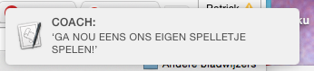

Naam: cliche_coach.py

Langs de amateur voetbal velden zijn ontzettend veel coaches te vinden met de aller beste bedoelingen. Helaas bakken ze er vaak helemal niks doen en gooien ze er alleen maar cliches uit. Deze tool veranderd je computer in zo'n coach. Om de minuut gooit hij er een willekeurig coache cliche uit.

De tool is te installeren door twee bestandjes ( cliche_coach.py en zinnen.json ) te downloaden en op je desktop te plaatsten. In de terminal typ je de volgende combinatie van commando's om de tool op te roepen. cd desktop <enter> python cliche_coach.py <enter>

Nadat je de tool hebt aangezet kan je plaats nemen in de dugout van een willekeurige amateur voetbal wedstrijd. Lees de berichten voor en niemand zal merken dat je eigenlijk niks van voetbal begrijpt.

The MIT License (MIT)

Copyright (c) 2015 Graphic Design Arnhem at ArtEZ Academy

Permission is hereby granted, free of charge, to any person obtaining a copy
of this software and associated documentation files (the "Software"), to deal
in the Software without restriction, including without limitation the rights
to use, copy, modify, merge, publish, distribute, sublicense, and/or sell
copies of the Software, and to permit persons to whom the Software is
furnished to do so, subject to the following conditions:

The above copyright notice and this permission notice shall be included in all
copies or substantial portions of the Software.

THE SOFTWARE IS PROVIDED "AS IS", WITHOUT WARRANTY OF ANY KIND, EXPRESS OR
IMPLIED, INCLUDING BUT NOT LIMITED TO THE WARRANTIES OF MERCHANTABILITY,
FITNESS FOR A PARTICULAR PURPOSE AND NONINFRINGEMENT. IN NO EVENT SHALL THE
AUTHORS OR COPYRIGHT HOLDERS BE LIABLE FOR ANY CLAIM, DAMAGES OR OTHER
LIABILITY, WHETHER IN AN ACTION OF CONTRACT, TORT OR OTHERWISE, ARISING FROM,
OUT OF OR IN CONNECTION WITH THE SOFTWARE OR THE USE OR OTHER DEALINGS IN THE
SOFTWARE.
