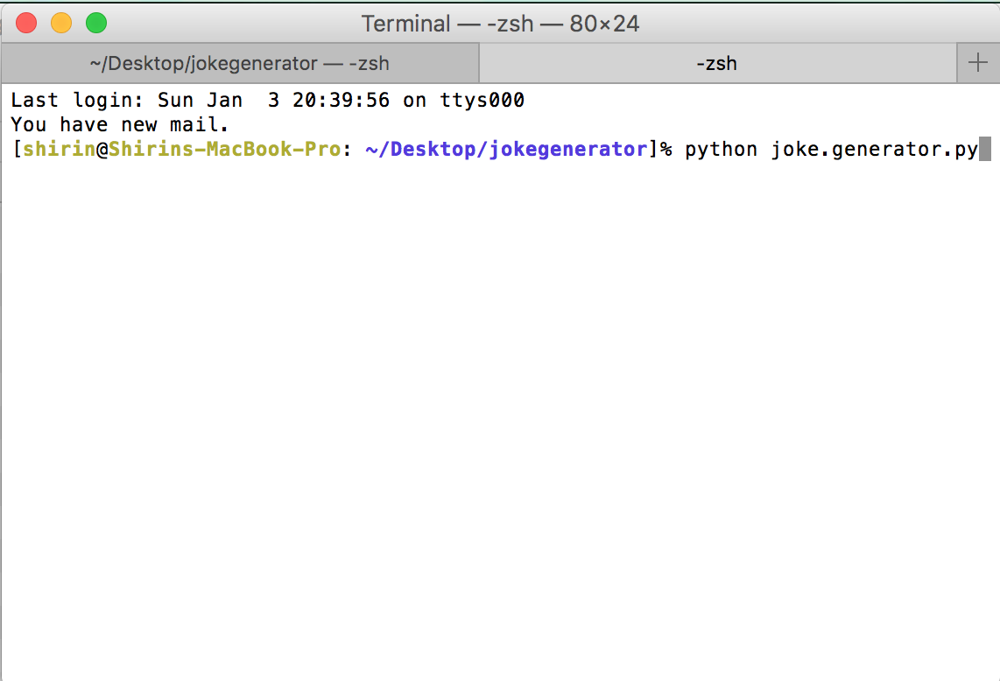
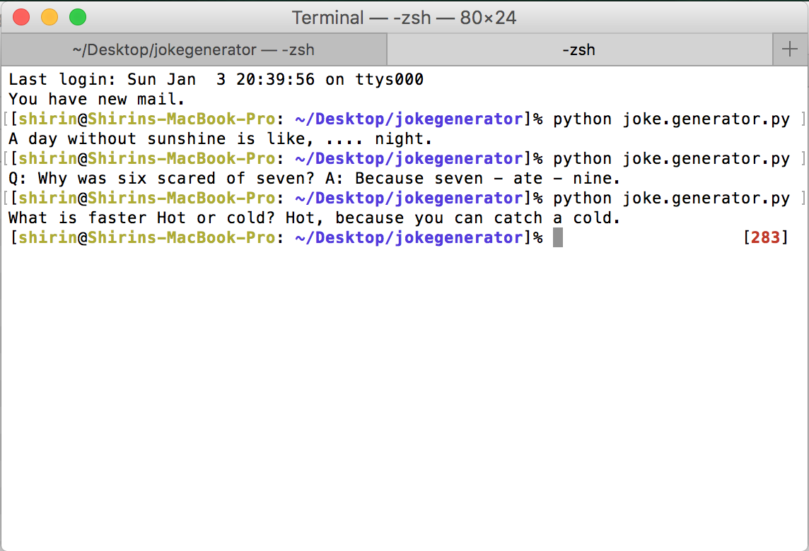

# Joke Generator 

## Description
The Joke Generator is a little program which aims to lighten peoples day.   
How it works: 
Activated from out the terminal, it tells you a joke! The jokes are selected randomly so that you will be amused overtime you run the program.
  
The program is written in python and uses a database
## How to install
Download the [python file](joke.generator.py) and the [database](database.py) to your computer, make sure to place it in a handy location. Open the terminal application and give the python command followed by the path to joke.generator.  
For example 
python /Users/shirin/Desktop/jokegenerator/joke.generator.py

## Screenshots
 
 

## License (MIT License)
Copyright © 2016 Shirin Pfisterer shrine.pfisterer@gmail.com 
Permission is hereby granted, free of charge, to any person obtaining a copy of this software and associated documentation files (the “Software”), to deal in the Software without restriction, including without limitation the rights to use, copy, modify, merge, publish, distribute, sublicense, and/or sell copies of the Software, and to permit persons to whom the Software is furnished to do so, subject to the following conditions: 
The above copyright notice and this permission notice shall be included in all copies or substantial portions of the Software.
THE SOFTWARE IS PROVIDED “AS IS”, WITHOUT WARRANTY OF ANY KIND, EXPRESS OR IMPLIED, INCLUDING BUT NOT LIMITED TO THE WARRANTIES OF MERCHANTABILITY, FITNESS FOR A PARTICULAR PURPOSE AND NONINFRINGEMENT. IN NO EVENT SHALL THE AUTHORS OR COPYRIGHT HOLDERS BE LIABLE FOR ANY CLAIM, DAMAGES OR OTHER LIABILITY, WHETHER IN AN ACTION OF CONTRACT, TORT OR OTHERWISE, ARISING FROM, OUT OF OR IN CONNECTION WITH THE SOFTWARE OR THE USE OR OTHER DEALINGS IN THE SOFTWARE.

			
