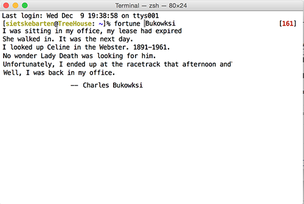

# Sietske's work for Text IO 

## Homework
###Array
[the Array](textIO/arrayinterminal.rtf)

###Dictionary
[Format](textIO/format.py)

[Dictionary Room](textIO/room_file.py)

###Data structure I
[Data structure iTunes](textIO/itunes.pv)

 
##Exercices for working with the shell

###1. Months and Days
[Months and days](textIO/months-and-days.rtf)

### 2. Search files
[Search files](textIO/searchfiles.rtf)

### 3. Cowsay
[Cowsay](textIO/cowsay.rtf)

###4. Research Edgar Allan Poe
[Edgar Allan Poe](textIO/allanpoe.rtf)

###5. Phone home
[Phone Home](textIO/phonehome.rtf)

 
## Concept
A fortune inspired program with random quotes from Charles Bukowski 

## Prototype: working demo

## Program and Documentation

			
